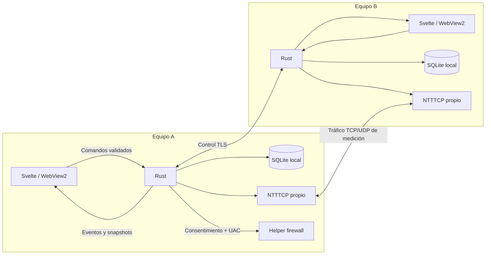

# Arquitectura de NetworkBench

**Estado:** propuesta, 2026-09-21. No describe una aplicación implementada.

Base: constitución 0.4.0 **no ratificada**, `Historias.md` §§1–28 y su estrategia de
pruebas. No resuelve Q1–Q4 ni G1–G6. La jerarquía documental de `AGENTS.md` sigue vigente.
La organización por features evoluciona la estructura propuesta en `Historias.md` §25;
debe aceptarse mediante ADR-002 antes del bootstrap de la aplicación.

Documentos relacionados:

- `docs/governance/ASSESSMENT.md`: evaluación, riesgos y decisiones pospuestas.
- `docs/governance/ADRS.md`: decisiones arquitectónicas iniciales.
- `docs/governance/CONVENTIONS.md`: convenciones tecnológicas.
- `docs/governance/QUALITY.md`: testing, controles, CI y Definition of Done.
- `docs/governance/PLAN-CHECK.md`: revisión obligatoria de `plan.md`.
- `docs/governance/CONSTITUTION-PROMPT.md`: entrada propuesta para el flujo oficial.

## 1. Decisión global

NetworkBench será un monolito modular de escritorio. Svelte presenta; Rust autoriza,
coordina y ejecuta; SQLite conserva; NTTTCP mide. Cada equipo ejecuta la misma aplicación
y puede iniciar o recibir una prueba. Existe un listener de control entre peers, no un
backend HTTP ni un servidor central. Node solo interviene en desarrollo y build.

No se adopta Clean Architecture, DDD u otro patrón completo. Se toman únicamente:

- módulos con API pública;
- dependencias dirigidas;
- reglas puras separadas de I/O;
- interfaces estrechas para efectos sustituibles en pruebas;
- validación explícita en cada frontera.

No se necesitan microservicios, ORM, contenedor de inyección, bus global, event sourcing,
CQRS ni framework de plugins. Un crate Rust principal y el helper elevado separado son
suficientes inicialmente.



Las flechas muestran comunicación en ejecución. mDNS descubre candidatos, pero no
autentica. El actualizador es una frontera independiente y no participa en el benchmark.

## 2. Features y ownership lógico

| Área | Frontend | Rust | Responsabilidad pública |
|---|---|---|---|
| Equipos | `features/peers` | `discovery`, `pairing`, `identity` | Descubrir, conectar, identificar y gestionar confianza |
| Sesión | `features/session` | `control` | Plan, estados, exclusión, aceptación y cancelación |
| Medición | Dentro de sesión | `engine`, `sampling`, `netinfo` | Ejecutar el motor y producir hechos medidos |
| Resultado | `features/results` | `diagnostic` | Interpretar y presentar resultados sin I/O |
| Historial | `features/history` | `history` | Guardar, consultar, comparar y eliminar resultados |
| Exportación | `features/export` | `export` | Anonimizar y exportar un resultado entregado explícitamente |
| Ajustes | `features/settings` | `settings`, `firewall` | Preferencias, confianza y operaciones de firewall |
| Ciclo de aplicación | `app` | `app`, `platform`, `updater` | Arranque, ventana, bandeja, cierre y actualización |

Son límites de módulos y ownership, no servicios desplegables ni modelos de dominio
duplicados. No se crean carpetas vacías para completar una plantilla.

## 3. Estructura propuesta

Las rutas de aplicación siguientes son futuras:

```text
src/
  main.ts
  app/                              shell, navegación y composición
  features/
    peers/
    session/
    results/
    history/
    export/
    settings/
  lib/
    api/                            transporte Tauri y suscripciones
    contracts/                      schemas Zod por área
    components/                     primitivas visuales compartidas
    design-system/                  tokens y adaptación de tema
    i18n/
    config/                         único lector de import.meta.env
    logging/                        único acceso a loglevel
    window.ts                       adaptador de ventana

src-tauri/
  src/
    lib.rs                          entrada Tauri y registro de comandos
    app.rs                          ensamblaje explícito
    ipc/                            comandos y eventos por área
    model/                          valores compartidos sin I/O
    control/
      domain.rs                     máquina de estados y reglas
      service.rs                    coordinación
      ports.rs                      efectos requeridos
      transport.rs                  adaptación TLS/framing
    pairing/
    identity/
    discovery/
    engine/
      ntttcp/{args,process,parser}.rs
    sampling/
    netinfo/
    diagnostic/{rules.rs,thresholds.json}
    history/{migrations/,queries/}
    settings/
    export/
    firewall/
    platform/
    logging/
    updater/
    errors/
  helper/                           ejecutable elevado aislado
  permissions/
  capabilities/
  tests/

engine/                             ntttcp.exe, VERSION y licencia
locales/{es.json,en.json}
tests/{contracts,fixtures,windows}/
e2e/
scripts/
```

Una feature comienza solo con lo necesario. Convención orientativa:

```text
features/session/
  index.ts                          API pública
  SessionScreen.svelte
  model.svelte.ts                   estado presentacional privado
  client.ts                         operaciones IPC de la feature
```

Los tests unitarios permanecen junto al código. Integración, contratos, E2E y pruebas
Windows viven en los directorios transversales indicados.

## 4. Reglas de dependencias frontend

`index.ts` exporta únicamente componentes, operaciones y tipos consumibles desde fuera.
El estado mutable, helpers y cliente IPC de una feature son privados. Dentro de la feature
se usan imports relativos; fuera se importa su API pública. No se crean barrels globales
con `export *`.

| Origen → destino | Regla |
|---|---|
| `app` → API pública de feature | Permitido para composición |
| Feature → sí misma | Permitido, sin ciclos |
| `session` o `history` → `results/index.ts` | Permitido para reutilizar la vista de resultado |
| Otra feature → feature | Prohibido inicialmente; una arista nueva exige Architecture Check |
| Feature → `lib/components`, `design-system`, `i18n`, `contracts`, `logging` | Permitido por API pública |
| `feature/client.ts` → `lib/api` | Permitido |
| Componente/modelo → SDK Tauri | Prohibido |
| `lib` → feature o `app` | Prohibido |
| UI → SQL, procesos o archivos privados | Prohibido; usar IPC autorizado |

Excepciones explícitas:

- `lib/window.ts` encapsula el SDK de ventana.
- `lib/logging` puede reenviar mediante `lib/api`; `lib/api` no importa logging.
- Tema e i18n reciben preferencias desde `app`; no importan `features/settings`.
- `results` no tiene efectos ni cliente IPC.
- El shell entrega el `SessionResult` elegido a exportación; exportación no lee stores de
  historial o sesión.

No se comparte un store mutable entre features.

## 5. Reglas de dependencias Rust

Hay tres responsabilidades dentro de módulos por capacidad: reglas puras, casos de uso
y adaptadores. No son tres árboles globales ni obligan a crear una clase por operación.

| Origen → destino | Regla |
|---|---|
| `app` → servicios y adaptadores | Permitido; único ensamblaje completo |
| `ipc` → APIs de servicios | Permitido; valida DTO y convierte errores |
| Servicio → dominio y puertos requeridos | Permitido |
| Dominio puro → `model`, `errors` | Permitido |
| Dominio puro → Tauri, Tokio, SQL, red o FFI | Prohibido |
| Adaptador → trait que implementa y valores de modelo | Permitido |
| Servicio → adaptador concreto | Prohibido |
| `engine/ntttcp` → contrato del motor | Permitido; único traductor de argumentos/XML |
| `history` → SQL y modelo | Permitido; no invoca sesión ni diagnóstico |
| `export` → resultado y destino | Permitido; no consulta SQL ni recalcula diagnóstico |
| Helper → UI, Tauri, sesión o BD de usuario | Prohibido |

Los puertos residen junto al consumidor. Por ejemplo, `control/ports.rs` puede declarar
`SessionStore`; `history` lo implementa. No se introduce `Repository<T>` genérico.
`pub(crate)` no impide imports indebidos entre módulos hermanos; el análisis de arquitectura
debe controlar también el grafo real.

```text
VÁLIDO: history/index.ts → results/index.ts → lib/components
VÁLIDO: session/client.ts → lib/api → @tauri-apps/api/core
VÁLIDO: ipc/session.rs → control::SessionService
VÁLIDO: history/sqlite.rs → control::ports::SessionStore

INVÁLIDO: history/History.svelte → session/model.svelte.ts
INVÁLIDO: lib/components/Card.svelte → features/settings
INVÁLIDO: diagnostic/rules.rs → rusqlite::Connection
INVÁLIDO: control/service.rs → history/sqlite.rs
INVÁLIDO: export → engine/ntttcp/parser.rs
```

Una arista no indicada requiere revisión en el plan antes de incorporarse.

## 6. Estado, concurrencia y flujos

Rust es autoridad de sesión, autorización, resultados y preferencias persistidas. Svelte
posee campos aún no enviados, selección, filtros y estado visual. Una condición visual no
constituye autorización.

Un coordinador por instancia serializa las decisiones de la única sesión activa. Usa colas
acotadas y un camino de cancelación/control que no quede detrás de muestras. No es una
plataforma de actores. No se mantienen locks durante `.await`; el trabajo bloqueante se
ejecuta en trabajadores limitados y con lifecycle explícito.

```text
Iniciar:
UI → Zod → cliente IPC → validación/autorización Rust
   → coordinador → adaptadores → motor verificado

Completar:
EngineResult → diagnóstico puro → SessionResult
             → intercambio/ACK → transacción local → snapshot UI

Cancelar:
mandato idempotente → aviso remoto con plazo → detener procesos propios
                    → liberar recursos → parcial explícito → terminal
```

G2 debe cerrar el orden de plan, emparejamiento y aceptación. G3 debe cerrar tamaños,
temporización, intercambio y reconciliación. Esta arquitectura no decide esas puertas.

Los eventos IPC llevan identidad de sesión y orden para descartar eventos obsoletos. Existe
snapshot inicial y recuperación cuando se pierden eventos. El contrato debe evitar la carrera
entre suscripción y snapshot. Muestras agrupadas a un máximo de 4 Hz y buffers acotados.

## 7. Persistencia y contratos

`history` posee el esquema SQLite y todas las escrituras. Usa SQL parametrizado, consultas
específicas, transacciones e idempotencia por `sessionId`. Comienza con una conexión de
escritura en un trabajador dedicado y cola acotada. Un pool solo se incorpora tras medirlo.

Las migraciones son numeradas e inmutables después de distribuirse. Antes de migrar se crea
un backup coherente con WAL y se prueba su restauración. Una versión antigua rechaza un
esquema futuro. Nunca se reinicializa o borra una BD silenciosamente.

`settings` posee JSON versionado, validado y escrito atómicamente. `identity` posee los
secretos DPAPI. WebView no es persistencia autoritativa.

Se versionan por separado:

1. aplicación;
2. protocolo peer;
3. resultado exportable;
4. esquema de persistencia.

Rust aplica Serde y validadores autoritativos; TypeScript usa Zod y tipos inferidos. Fixtures
válidos e inválidos comprueban equivalencia. Un `u64` que pueda superar el rango seguro de
JavaScript cruza JSON como cadena decimal. Ausencia de datos no se convierte en cero.

## 8. Errores, logging, configuración y seguridad

Los módulos usan errores tipados. En fronteras se convierten a código NB, detalles seguros,
issues por campo y claves i18n. No se usan strings arbitrarios como protocolo, `unwrap` sobre
entradas externas ni fallos silenciados. Un fallo se registra una vez en la frontera responsable.

Logging y configuración pasan por las fachadas constitucionales. No se registran secretos,
`sessionId`, huellas ni payloads crudos. Los buffers son acotados y un fallo del logger no
bloquea la cancelación. La discrepancia con `Historias.md` §22 sigue abierta.

Todo dato del peer, WebView, SQLite, archivo o variable se trata como no confiable. Los
comandos Tauri son estrechos; no se expone shell, SQL o filesystem genérico. Permisos IPC y
consentimiento de negocio se prueban por separado. Registrar un comando propio no demuestra
que una capability lo restrinja: se requieren pruebas positivas y negativas reales.

mDNS no concede confianza. El helper es el único proceso elevado, usa una allowlist cerrada
y protege su solicitud frente a sustitución. NTTTCP se lanza por ruta absoluta, hash verificado,
argumentos estructurados y Job Object. El cleanup acredita propiedad del proceso.

## 9. Abstracciones admitidas

| Abstracción | Problema concreto que evita | Límite |
|---|---|---|
| API de feature | Imports profundos y consumidores invisibles | Una entrada por feature |
| Puertos de I/O | Tests que exigen red, procesos o BD reales | Solo efectos sustituibles |
| `BenchmarkEngine` | Argumentos y XML dispersos | Un motor real en v1 |
| Coordinador de sesión | Carreras y efectos duplicados | Una sesión; sin framework |
| Cliente IPC + schemas | Contratos divergentes por componente | Transporte común, API por feature |
| Propietario SQLite | Migraciones y escrituras incoherentes | Consultas específicas, sin ORM |
| Fachadas config/logging | Secretos y comportamiento disperso | Contratos mínimos |

**Complexity requires justification.** Toda capa, framework, servicio, cola, cache o
abstracción transversal nueva debe documentar problema observado, alternativa local, coste,
responsable, pruebas y condición de retirada. La reutilización futura hipotética no basta.

## 10. Evolución

No se prepara hoy un segundo motor, nube, otras plataformas, generación de contratos,
múltiples crates o caching de resultados. Se evoluciona ante un requisito aprobado o evidencia:
un consumidor independiente, límites que el compilador deba reforzar, consultas lentas medidas,
errores repetidos de contratos o coste de build demostrado.

Testing, enforcement, gates, CI y Definition of Done se definen en
`docs/governance/QUALITY.md`.
