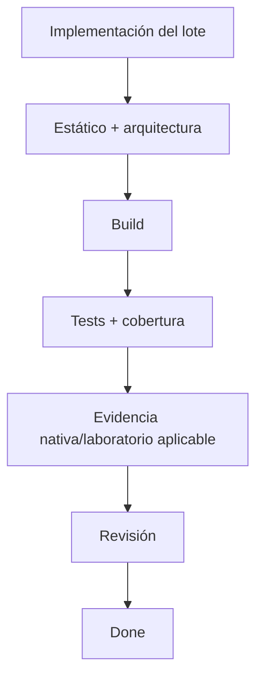

# Calidad, pruebas y automatización

**Estado:** propuesta. No hay hoy comandos de producto, suites ni CI. Los nombres futuros
de esta página son contratos de bootstrap, no evidencia de ejecución.

## Estrategia de testing

La estrategia detallada de `Historias.md` sigue siendo normativa. Esta página la convierte
en gates arquitectónicos sin duplicar cada caso.

| Riesgo | Evidencia mínima |
|---|---|
| Umbrales, planes, métricas, parser y nulos | Unitarios Rust con tablas de fronteras y XML auténtico saneado |
| Estado, duplicados, timeout y cancelación | Unitarios con reloj/motor sustituibles + integración del coordinador |
| Equivalencia Zod/Serde | Fixtures válidos e inválidos consumidos por ambos lenguajes |
| SQLite y migraciones | Archivo temporal real, WAL, rollback, reinicio, backup y restauración |
| TLS, identidad y confianza | Dos peers aislados con identidades sintéticas y transporte real |
| Componentes | Conducta observable, formularios, callbacks, semántica y foco |
| Layout, CSS y accesibilidad | Navegador real, visuales seleccionados, axe, teclado y revisión humana |
| IPC, DPAPI, Job Objects y ventana | Aplicación/harness nativo Windows |
| Firewall, UAC, instalador y updater | VM/laboratorio aislado y artefacto exacto |
| Throughput y coste de la app | Dos equipos/hardware documentado, sin cobertura o traces pesados |

Playwright con bridge IPC simulado es una suite de frontend. No demuestra IPC, Tauri,
WebView2 empaquetado, UAC, firewall o instalación. Loopback prueba coordinación, no precisión
de una LAN, mDNS multitarjeta o capacidad de enlace.

Reglas comunes:

- fixtures, BD, identidades, puertos y procesos aislados por worker;
- cleanup que solo elimina recursos propios;
- relojes, IDs, locale, zona y aleatoriedad controlados;
- sin sleeps como sincronización ni Internet en suites rápidas;
- expected calculado independientemente, no copiando el algoritmo;
- regresión automatizada para defectos lógicos cuando sea posible;
- pruebas nativas/manuales con pasos, entorno, resultado y limitaciones;
- mutation testing selectivo solo después de estabilizar suites y medir su coste.

Los umbrales de cobertura de Q2 permanecen propuestos. No se inventa un porcentaje alternativo.

## Enforcement arquitectónico

| Regla | Documento | Verificación automática | Herramienta/estado |
|---|---|---|---|
| Sistema de instrucciones coherente | `AGENTS.md` y `.agents/` | Sí | `node scripts/agent/verify.mjs`, existente |
| Protección de fuentes históricas | Reglas universales | Sí | Hook PreToolUse + pre-commit, existentes |
| Tokens en referencia de diseño | `Design/` | Parcial | Verificador existente; no prueba accesibilidad |
| Imports por API pública y aristas | `ARCHITECTURE.md` | Futura | ESLint/análisis de dependencias seleccionado en bootstrap |
| Ausencia de ciclos | `ARCHITECTURE.md` | Futura | Grafo que entienda aliases, reexports e imports dinámicos |
| Dominio Rust sin infraestructura | `ARCHITECTURE.md` | Futura | Compilación + análisis de imports/rutas |
| TypeScript/Svelte estricto | `CONVENTIONS.md` | Futura | `pnpm check` con cero diagnósticos |
| Rust consistente | `CONVENTIONS.md` | Futura | fmt, Clippy y compilación fijada |
| Contratos equivalentes | `ARCHITECTURE.md` | Futura | Fixtures TS/Rust positivos y negativos |
| IPC permitido/denegado | `ARCHITECTURE.md` | Futura | Harness Tauri real |
| Migraciones recuperables | `ARCHITECTURE.md` | Futura | Integración SQLite y restauración |
| Logger/config únicos | `CONVENTIONS.md` | Futura | Imports prohibidos + pruebas de redacción |
| i18n, tokens y aspecto nativo | Design + requisitos | Futura | Scripts y navegador real |
| Licencias y dependencias | Constitución | Futura | Inventario/scanners fijados |
| Secretos fuera de artefactos | Constitución | Futura | Escaneo de fuente y paquete final |
| Precisión y coste | `Historias.md` | Futura | Casos conocidos + laboratorio |
| Simplicidad justificada | `PLAN-CHECK.md` | Parcial | Checklist + revisión humana |

Los analizadores de arquitectura tienen pruebas negativas: introducir deliberadamente una
arista prohibida debe hacer fallar el control. Un analizador que ignora una sintaxis no puede
declarar el grafo aprobado. No se crea un framework propio cuando una herramienta mantenida
resuelva la regla; la selección forma parte de G5/bootstrap.

## Quality gates

El bootstrap proporcionará un único comando agregado:

```text
pnpm verify
```

Debe ejecutar, en orden lógico:

1. configuración, versiones, lockfiles y recursos;
2. formato, lint, imports y arquitectura;
3. `pnpm check` con cero errores y advertencias;
4. build frontend y Rust;
5. unitarios, componentes, contratos e integración determinista;
6. cobertura separada por lenguaje;
7. smoke de frontend contra el build;
8. consolidación de informes y código de salida distinto de cero ante cualquier gate fallido.

Puede paralelizar etapas independientes, pero ninguna etapa dependiente elude `pnpm check`.
La ausencia inesperada de tests, una suite omitida o un retry exitoso tras un primer fallo no
equivalen a éxito limpio.

Evidencia adicional por cambio:

| Cambio | Gate adicional |
|---|---|
| Documentación | Referencias y verificadores documentales aplicables |
| Diagnóstico/reglas | Fronteras, nulos, precisión y consumidores |
| UI | Componentes, i18n, accesibilidad y visual relevante |
| IPC/protocolo | Equivalencia, compatibilidad y ambos consumidores |
| Persistencia | Migración, backup, restauración y reinicio |
| Motor/lifecycle | Proceso real, timeout, cancelación y cleanup |
| Seguridad/firewall | Casos hostiles, denegación, consentimiento y VM |
| Distribución | Instalar, actualizar y desinstalar el artefacto exacto |

## Definition of Done para agentes y humanos

Una tarea está terminada cuando:

- cumple el alcance y todos sus criterios observables;
- no deja pruebas del lote para una fase posterior;
- respeta APIs públicas, dependencias y ADR aceptados;
- valida entradas y salidas en las fronteras afectadas;
- cubre errores, límites, cancelación y cleanup aplicables;
- ejecuta los gates aplicables sobre la revisión final;
- registra comando, código de salida, resultado, primer fallo y reintentos;
- diferencia evidencia simulada, nativa, manual y de laboratorio;
- revisa contratos, migraciones, privacidad y rendimiento cuando corresponda;
- recibe revisión humana proporcional al riesgo;
- declara expresamente lo no verificado y lo pendiente.

Una suite local verde no cierra un criterio que exige dos equipos, UAC, WebView2 empaquetado
o instalación real.



## Pipeline CI propuesto

En push y pull request:

```text
checkout + instalación frozen/locked
  → versiones + formato + lint + arquitectura + pnpm check
    → unitarios/componentes/contratos/cobertura
    → integración Rust aislada
    → build frontend/Rust
      → smoke/recorridos UI aplicables
        → consolidación bloqueante
```

Política:

- acciones fijadas por SHA completo y permisos mínimos;
- sin secretos de publicación para PR no confiables;
- no ejecutar código no confiable en contexto privilegiado;
- imagen y builds Windows registrados;
- cachear dependencias/compilación, no resultados como evidencia nueva;
- conservar informes y artefactos de fallo solo con datos sintéticos;
- serializar firewall, instalación, benchmarks y otros recursos globales;
- ampliar matriz según riesgo, sin llamar compatible a un SO no ejecutado.

En una etiqueta `vX.Y.Z` explícita:

```text
gates sobre el commit etiquetado
  → build y empaquetado
  → pruebas del instalador exacto
  → evidencia nativa/laboratorio exigida
  → firma + manifiesto del mismo artefacto
  → publicación autorizada
```

La creación o modificación de CI, etiquetas y releases requiere las autorizaciones del
repositorio; esta propuesta no las concede.

## Nuevas dependencias

Toda dependencia significativa se justifica en `plan.md`:

```text
Necesidad concreta:
Alternativa estándar o existente:
Motivo para no usarla:
Versión y compatibilidad:
Mantenimiento:
Licencia y redistribución:
Seguridad:
Impacto en tamaño, CPU, memoria y build:
Responsable de actualización:
Prueba de integración:
```

Una dependencia que cambie runtime, persistencia, protocolo, seguridad, framework o una
capacidad transversal requiere ADR. Una dependencia local y reversible puede justificarse
solo en el plan. No se añade una segunda solución para el mismo problema porque un agente la
conozca mejor. Seleccionar una dependencia no autoriza instalarla o modificar lockfiles.

## Selección de checks durante desarrollo

Durante edición se ejecuta primero la suite próxima al cambio. Al checkpoint se ejecuta
`pnpm verify` más la evidencia adicional del lote. La suite completa de release no se ejecuta
tras cada cambio pequeño. Si el alcance de impacto es incierto, se amplía a consumidores del
contrato, no solo al grafo de imports TypeScript.

