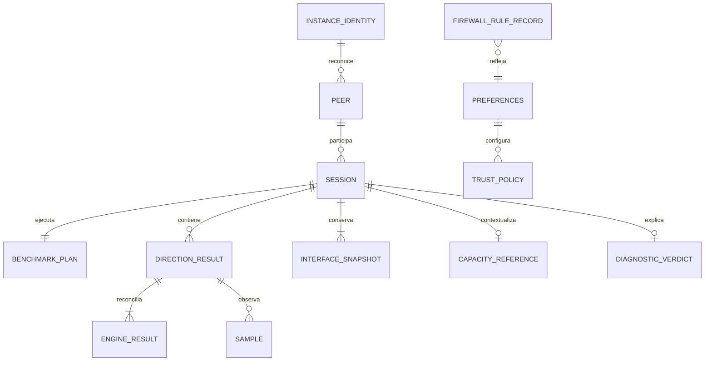
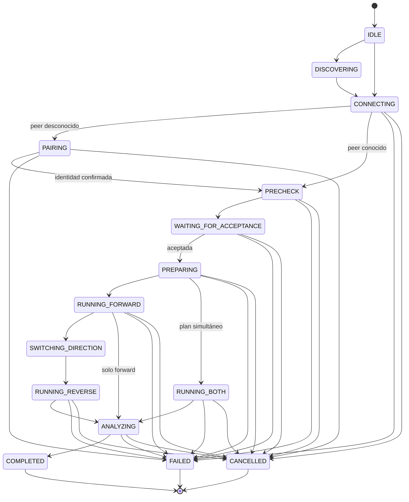

# Modelo de datos: NetworkBench v1

**Fecha**: 2026-09-21  
**Constitución**: 0.7.0, no ratificada  
**Fuentes**: `spec.md`, `Historias.md` §§6–24 y `ARCHITECTURE.md`

El modelo distingue valores de dominio, snapshots históricos y registros de infraestructura.
Los nombres son conceptuales; no prescriben structs, tablas ni componentes uno a uno.

## Convenciones

- Identificadores de sesión/instancia: UUID v4 en forma canónica.
- Fechas: UTC ISO 8601 en contratos; representación nativa apropiada dentro de Rust/SQLite.
- Duraciones: milisegundos enteros salvo campos del plan expresamente en segundos.
- Caudales: bit/s enteros; tamaños y contadores: bytes/enteros sin pérdida.
- Todo `u64` potencialmente mayor que `Number.MAX_SAFE_INTEGER` cruza JSON como cadena decimal.
- Ausencia, invalidez y cero son estados distintos.
- Texto remoto se normaliza NFC, elimina controles/bidi, se limita y nunca se renderiza como HTML.
- Protocolo peer, `SessionResult`, SQLite y ajustes evolucionan con versiones independientes.

### Equivalencias con `spec.md` (Key Entities)

| `spec.md` | Este modelo | Nota |
|---|---|---|
| Instancia | `InstanceIdentity` | |
| Peer | `Peer`, `DiscoveredPeer` | `DiscoveredPeer` es la vista efímera del descubrimiento |
| Solicitud | `BenchmarkRequest` | |
| Plan | `BenchmarkPlan` | |
| Sesión | `Session` | |
| Dirección | `DirectionResult` | |
| Resultado | `SessionResult`, `DiagnosticVerdict` | el veredicto es parte del snapshot |
| Muestra | `Sample` | |
| Interfaz | `InterfaceSnapshot`, `CapacityReference` | la referencia de capacidad deriva del adaptador o del usuario |
| Regla de interpretación | `thresholds.json` + reglas en `diagnostic/` | no es entidad persistida; se versiona por hash |
| Preferencias | `Preferences` | |
| Regla de firewall | `FirewallRuleRecord` | |
| Registro de diagnóstico | `ErrorDescriptor`, `DiagnosticEvent` | |
| — | `PreflightCheck`, `EngineResult` | detalle técnico sin entidad de producto propia |

## Mapa de agregados

## 1. InstanceIdentity

Identidad persistente de una instalación.

| Campo | Significado | Validación / privacidad |
|---|---|---|
| `instanceId` | identificador visible del protocolo | UUID v4, no concede confianza |
| `displayName` | nombre presentado a peers | texto saneado, máximo 48 |
| `certificate` | certificado público autofirmado | clave Ed25519 (constitución III); parámetros restantes fijados por contrato de identidad |
| `privateKey` | clave privada | nunca sale del backend; protegida con DPAPI |
| `fingerprint` | huella SHA-256 del certificado | comparación constante; no registrar completa |
| `createdAt` | creación de identidad | UTC |

Una identidad regenerada invalida la confianza asociada a su huella anterior.

## 2. Peer

Representa una identidad remota conocida, separada de su localización actual.

| Campo | Significado | Validación |
|---|---|---|
| `fingerprint` | clave estable de confianza | obligatoria y única |
| `instanceId` | identificador declarado más reciente | UUID; no es clave de confianza |
| `displayName` | nombre remoto saneado | máximo 48 |
| `alias` | nombre local opcional | texto local saneado |
| `lastAddress` | último endpoint observado | host/IP y puerto validados |
| `trustLevel` | `known`, `trusted` | unión cerrada; favorito es independiente |
| `favorite` | preferencia local | booleano |
| `autoAccept` | consentimiento persistente explícito | false por defecto; solo peer trusted |
| `pairedAt`, `lastSeenAt` | auditoría local | UTC |

`discovered`, `known`, `favorite`, `trusted` y `autoAccept` no se colapsan en un solo estado.

## 3. DiscoveredPeer

Proyección efímera de mDNS/manual antes de autenticación.

Campos: dirección, puerto, nombre anunciado, versión de protocolo/app, interfaces observadas y
última señal. Desaparece por timeout. Nunca crea o eleva confianza por sí misma.

## 4. BenchmarkRequest

Solicitud pendiente que une peer, plan y consentimiento.

Campos: `requestId`, peer, `BenchmarkPlan`, duración estimada, interfaz propuesta, instante de
expiración y estado (`pending`, `accepted`, `rejected`, `timedOut`, `busy`, `invalid`). Solo puede
existir una solicitud pendiente o sesión activa por instancia.

## 5. BenchmarkPlan

Contrato validado en iniciador y receptor.

| Campo | Validación |
|---|---|
| `protocol` | `tcp` o `udp` |
| `directions` | forward, reverse o ambos; secuencial por defecto; simultáneo avanzado |
| `streams` | 1–64 por sentido en secuencial; 1–32 por sentido en simultáneo (FR-042c, decisión 2026-09-21); G1/V-01 valida viabilidad/puertos |
| `bufferBytes` | rango cerrado definido en thresholds/plan |
| `warmupSeconds` | 0–10 |
| `measureSeconds` | 5–300 |
| `cooldownSeconds` | 0–10 |
| `basePort` | rango no privilegiado y bloque completo disponible |
| `addressFamily` | IPv4 o IPv6 explícita tras resolución |
| `localInterfaceId`, `remoteInterfaceId` | deben corresponder a la ruta elegida |
| `expectedCapacityBps` | opcional, entero positivo y origen manual |
| `udpTargetBps` | solo UDP; semántica pendiente V-02 |

Nunca contiene línea de comandos ni flags libres. El receptor reconstruye argumentos desde estos
campos. Los valores provisionales viven en un único recurso versionado y se registran con sesión.

## 6. Session

Agregado de coordinación vivo; no se expone mutable al frontend.

Campos principales: `sessionId`, rol local, peer, plan, estado, secuencia de eventos, timestamps,
cancelación, checks, recursos propios, resultados por dirección y fuente de reconciliación.

### Transiciones de estado

`DISCONNECTED` es una condición transitoria de recuperación; tras 15 segundos sin reconexión se
resuelve como `FAILED` con error tipado. Toda transición no listada se rechaza sin efectos.

## 7. PreflightCheck

Resultado estructurado de motor, adaptador, ruta, versión, espacio, puerto, permisos y firewall.

Campos: `checkId`, extremo, dirección, estado (`pending`, `passed`, `failed`, `warning`),
`errorCode`, detalles técnicos saneados, acción allowlisted y puerto alternativo opcional.

## 8. EngineResult

Hechos producidos por una ejecución local del motor.

Campos conceptuales: rol emisor/receptor, dirección, bytes, duración, throughput, paquetes,
retransmisiones, errores, CPU y detalles del motor. La salida cruda se mantiene acotada y separada;
solo se incluye en diagnóstico/exportación tras saneamiento y consentimiento.

Reglas:

- Parser estricto para campos requeridos y tolerante a elementos desconocidos.
- Campos exactos y capacidades se congelan tras G1/V-03.
- Código de salida no cero, timeout o XML inválido nunca produce resultado exitoso.
- El proceso pertenece a esta sesión y se identifica por handle/Job Object, no por nombre.

## 9. Sample

Observación temporal de interfaz/CPU de un extremo.

| Campo | Significado |
|---|---|
| `direction` | forward/reverse/both |
| `host` | local/remote, reinterpretado según perspectiva |
| `tMs` | tiempo monotónico desde START |
| `rxBps`, `txBps` | contadores derivados, opcional si hay hueco |
| `cpuPercent` | carga de sistema opcional |
| `gap` | marca de intervalo no observado |

Se producen inicialmente cada 500 ms, se agrupan para UI a ≤4 Hz y se conservan con límites
totales definidos por G3. Un hueco nunca se interpola como dato medido.

## 10. DirectionResult

Resultado de un sentido.

Campos: dirección, emisor, receptor, ambos `EngineResult`, `officialBps` procedente del receptor,
utilización opcional, estabilidad, retransmisiones, CPU por extremo, muestras, completitud y
coherencia. Solo es persistible como parcial si existen resultados de ambos extremos.

## 11. InterfaceSnapshot

Snapshot de la interfaz realmente usada, no de la más rápida.

Campos: identificador estable disponible, nombre/descripción saneados, MAC/IP, tipo físico/virtual,
estado, velocidad, driver, perfil de firewall y origen de clasificación. V-10 valida heurísticas.
Cambios posteriores no alteran el snapshot histórico.

## 12. CapacityReference

Campos: capacidad de ambos extremos, `refBps` opcional, origen (`manual`, `negotiated`, `wifi`,
`unknown`) y explicación. Una referencia desconocida impide veredicto de rendimiento, pero no
convierte la sesión en fallida.

## 13. DiagnosticVerdict

Snapshot de interpretación pura y versionada.

Campos: versión de reglas/umbrales; nivel global (`ok`, `warn`, `problem`, `notEvaluable`);
subresultados de capacidad, estabilidad, asimetría, retransmisiones y CPU; arrays ordenados de
`facts`, `observations`, `possibleCauses` y `actions` como claves i18n con parámetros tipados.

G4/V-06/V-07 fijan inclusividad de fronteras, percentiles, ceros y coherencia. Ninguna regla puede
emitir causalidad única. Con datos insuficientes, el subresultado es `notEvaluable`.

## 14. SessionResult

Snapshot exportable e histórico. Contrato completo en `contracts/session-result.md`.

Incluye schema, identidad/perspectiva de ambos peers, plan, timestamps, estado, capacidad,
direcciones, asimetría, veredicto, fuente, versiones de aplicación/motor/reglas y evidencia
suficiente. `completed` e `incomplete` son persistibles; un fallo sin medición queda solo en log.

## 15. Preferences

JSON local versionado y validado.

Áreas: idioma; tema (`system`, `light`, `dark`, inicial `dark`); reducción de movimiento; acción
de cierre; geometría; red/control; descubrimiento; interfaz preferida; confianza; firewall;
exportación; actualización; logging/diagnóstico. Un cambio incompatible con sesión activa se
rechaza o difiere explícitamente.

Escritura: archivo temporal en el mismo volumen, flush cuando aplique y reemplazo atómico. Un
archivo inválido no se acepta silenciosamente; se conserva para diagnóstico y se usa un estado
seguro explicado al usuario.

## 16. FirewallRuleRecord

Inventario de recursos propios, no fuente de autoridad sobre Windows.

Campos: identificador/nombre allowlisted, protocolo, puertos, programa, perfiles, versión creadora,
estado observado (`present`, `missing`, `modified`, `disabled`, `policyBlocked`) y timestamp.
Modificar/eliminar requiere consentimiento y el helper solo acepta formas cerradas.

## 17. ErrorDescriptor y DiagnosticEvent

`ErrorDescriptor`: código NB estable, severidad, claves de título/descripción/causas, acciones
allowlisted y campos técnicos permitidos.

`DiagnosticEvent`: `diagnosticId` independiente de `sessionId`, timestamp, nivel, módulo, evento,
resultado, campos saneados y `fatal` opcional. No contiene secretos, huellas, direcciones completas,
payloads ni salida cruda sin límites. Logging no es fuente de estado ni auditoría de seguridad.

## 18. Proyección de persistencia

Proyección inicial, propiedad exclusiva de `history`:

| Tabla/almacén | Clave | Relaciones / reglas |
|---|---|---|
| `schema_version` | versión única | versión futura bloquea escritura |
| `peers` | fingerprint | identidad/trust local |
| `sessions` | sessionId | referencia peer; snapshots plan/capacity/verdict/versiones |
| `direction_results` | sessionId + direction | hijo de sesión, delete controlado |
| `samples` | sessionId + direction + host + t | hijo acotado; conserva gaps |
| `interfaces_snapshot` | sessionId + host | snapshot histórico |
| `firewall_rules` | nombre propio | inventario/reconciliación |
| `settings.json` | schemaVersion | fuera de SQLite; escritura atómica |
| `identity/` | instancia | material público + secreto DPAPI |

No se persisten objetos de UI. No se expone una conexión o modelo SQL fuera del módulo propietario.

## 19. Invariantes

1. Una instancia tiene como máximo una sesión o solicitud aceptable activa.
2. Solo una identidad verificada y una aceptación válida permiten preparar el motor.
3. Todo plan se valida de nuevo en el receptor y nunca transporta argumentos libres.
4. `officialBps` procede del receptor o está ausente.
5. Resultado incompleto nunca se etiqueta como completo; ausencia nunca se convierte en cero.
6. Una transición/mensaje duplicado no repite efectos no idempotentes.
7. Cleanup solo afecta procesos, puertos, temporales y reglas cuya propiedad se demuestre.
8. Una sesión histórica conserva sus versiones y no se recalcula silenciosamente.
9. Una migración fallida conserva original y backup recuperable.
10. El frontend no puede elevar privilegios, ejecutar comandos arbitrarios ni escribir SQL.
