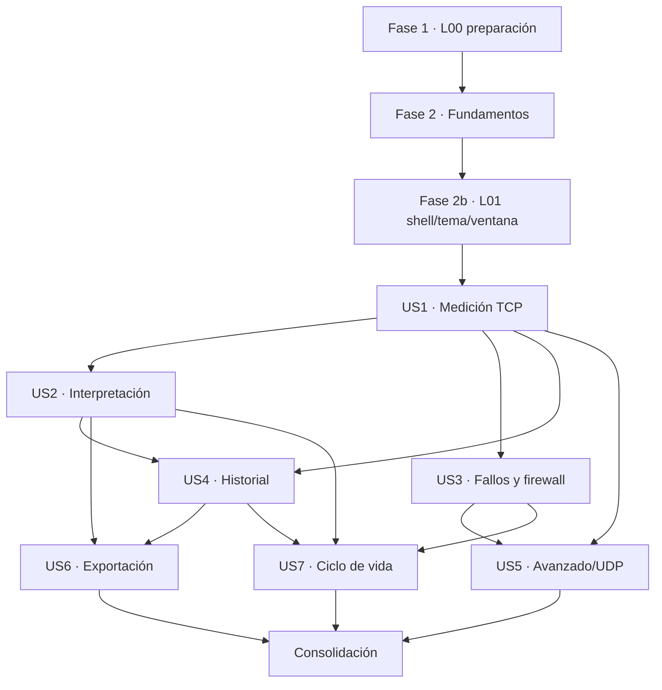

# Tareas: NetworkBench v1

**Entrada**: documentos de diseño en `specs/001-network-benchmark-v1/`  
**Constitución**: 0.7.0, no ratificada  
**Prerrequisitos**: `plan.md`, `spec.md`, `research.md`, `data-model.md`, `contracts/`, `quickstart.md`  
**Pruebas**: obligatorias por la especificación y la estrategia de calidad del proyecto

## Formato: `[ID] [P?] [Historia] Descripción con ruta`

- **[P]**: ejecutable en paralelo después de completar las dependencias de su fase; escribe archivos distintos.
- **[USn]**: historia de usuario de `spec.md`; solo aparece en fases de historia.
- Cada tarea incluye las rutas que puede crear o modificar. Un cambio fuera de ellas exige revisar ownership.
- No hacer commit, push, ramas, tags ni releases sin autorización Git específica.
- Un gate Q/G/V solo se cierra con decisión o evidencia registrada; nunca mediante una suposición de implementación.

## Fase 1: Preparación L00

**Propósito**: cerrar decisiones de bootstrap y crear una base reproducible antes de implementar historias.

- [x] T001 Registrar las decisiones del propietario sobre Q2, ADR-001–ADR-006 y los conflictos Windows/accesibilidad/streams/updater en `docs/governance/ADRS.md` y `specs/001-network-benchmark-v1/checklists/architecture.md` — hecho el 2026-09-21 (constitución 0.5.0–0.7.0 enmendada con permiso del propietario)
- [x] T002 Crear `VALIDACION.md` con estructura fija (entorno, comando, resultado, estado) e inventariar y probar G5 en Windows 10 22H2 y Windows 11 x64 (matriz Q1 decidida el 2026-09-21), registrando builds de SO, Rust/MSVC/SDK, Node/pnpm, WebView2 y NTTTCP con comandos y resultados en `VALIDACION.md`
- [x] T003 Crear los manifiestos versionados y sincronizados `package.json`, `pnpm-workspace.yaml`, `rust-toolchain.toml`, `src-tauri/Cargo.toml`, `src-tauri/tauri.conf.json` y `src-tauri/build.rs` conforme a la línea base aceptada
- [x] T004 Resolver versiones/features/licencias, generar `pnpm-lock.yaml` y `src-tauri/Cargo.lock`, y documentar cada desviación aprobada de la línea base en `docs/governance/ADRS.md`
- [x] T005 Configurar los comandos canónicos en `package.json` y `scripts/verify-app.mjs`: `pnpm check` = `svelte-check --tsconfig ./tsconfig.json --fail-on-warnings` (constitución VIII, cero errores y cero avisos), formato, lint, build, test y `pnpm verify`, que ejecuta `pnpm check` antes de cualquier test o build y falla si falla; sin declarar disponibles checks que aún no existan. `scripts/agent/verify.mjs` sigue verificando solo el sistema de instrucciones y no forma parte de `pnpm verify`
- [x] T006 [P] Crear únicamente la estructura inicial necesaria en `src/main.ts`, `src/app/`, `src/lib/`, `src-tauri/src/lib.rs`, `src-tauri/src/app.rs`, `tests/`, `e2e/`, `engine/` y `locales/`, sin carpetas vacías para features futuras
- [x] T007 Definir CSP, capabilities y permisos mínimos de la ventana principal en `src-tauri/capabilities/main.json`, `src-tauri/permissions/` y `src-tauri/tauri.conf.json`, sin shell, SQL ni filesystem genéricos
- [x] T008 [P] Configurar TypeScript estricto, Svelte/Vite/Tailwind 4, ESLint y Prettier en `tsconfig.json`, `svelte.config.js`, `vite.config.ts`, `eslint.config.js`, `.prettierrc.json` y `src/app.css`, usando runes y `@tailwindcss/vite`
- [x] T009 [P] Configurar Vitest/V8, Testing Library, Playwright/axe-core y cobertura Rust en `vitest.config.ts`, `playwright.config.ts`, `e2e/`, `.cargo/config.toml` y `scripts/test/`, distinguiendo mocks WebView de pruebas nativas
- [x] T010 **(requiere autorización específica del propietario: crea CI)** Crear CI baseline con instalación locked, estáticos, contratos, builds y suites dependientes en `.github/workflows/ci.yml`, fijando acciones por SHA y permisos mínimos
- [x] T011 Implementar checks mecanizables de imports, APIs legacy, logger único, claves es/en y contratos en `scripts/architecture/`, integrándolos en `scripts/verify-app.mjs`
- [x] T012 [P] Adaptar tokens y primitivas permitidas desde `Design/` en `src/lib/design-system/` y `src/lib/components/`, documentando procedencia sin modificar `Design/`
- [x] T013 Crear `LICENSE`, `THIRD_PARTY_NOTICES.md`, `engine/LICENSE` y `engine/VERSION`; verificar y registrar el SHA-256 de NTTTCP en `VALIDACION.md` antes de incorporarlo
- [x] T014 Ejecutar el checkpoint L00 definido en `specs/001-network-benchmark-v1/quickstart.md`, registrar resultados reales y pendientes G5/Q2/ADR en `VALIDACION.md` y no avanzar con dependencias incompatibles

**Checkpoint**: base locked, compilable y verificable; ninguna compatibilidad se afirma sin evidencia.

---

## Fase 2: Fundamentos compartidos

**Propósito**: contratos, errores, configuración, logging, persistencia base e IPC que bloquean todas las historias.

**⚠️ BLOQUEANTE**: ninguna historia comienza hasta que esta fase supera su checkpoint.

- [x] T015 [P] Definir ids, enteros exactos, timestamps, unidades y uniones `available/notAvailable/notEvaluable/invalid` en `src-tauri/src/model/` según `data-model.md` §§Convenciones y 19
- [x] T016 [P] Definir schemas Zod equivalentes para ids, enteros decimales y métricas discriminadas en `src/lib/contracts/common.ts`, usando `unknown` en fronteras y sin `any`, `!` ni defaults silenciosos
- [x] T017 Crear fixtures cruzados válidos/inválidos y round-trip de precisión en `tests/contracts/fixtures/`, `tests/contracts/common.test.ts` y `src-tauri/tests/contract_common.rs`
- [x] T018 [P] Implementar errores tipados, acciones allowlisted y catálogo NB inicial en `src-tauri/src/errors/` y `src/lib/contracts/errors.ts`, sin strings internos como protocolo
- [x] T019 [P] Implementar configuración Rust/TypeScript con único lector de entorno, validación al arranque y allowlist pública en `src-tauri/src/config/` y `src/lib/config/`
- [x] T020 [P] Implementar logging Rust estructurado, local, rotado y saneado en `src-tauri/src/logging/`, sin huellas, `sessionId`, secretos ni payloads crudos
- [x] T021 [P] Implementar wrapper frontend de `loglevel` y captura global controlada en `src/lib/logging/`, prohibiendo `console.*` en código de funcionalidad
- [x] T021b [P] Crear pruebas del contrato de logging exigidas por la constitución XIII en `src-tauri/tests/logging.rs` y `tests/contracts/logging.test.ts`: filtrado por nivel, precedencia Ajustes > `LOG_LEVEL`/`VITE_LOG_LEVEL` > default, valores inválidos que fallan al arrancar, captura global frontend sin duplicados ni bucles, redacción anidada y lista permitida, rotación 10 archivos / 50 MB, buffers llenos con resumen de pérdidas, fallo del sink sin bloquear cancelación, y formato `Europe/Madrid` en invierno, verano y durante el cambio de hora
- [x] T022 [P] Crear catálogos i18n es/en, formatos y comprobación de paridad en `locales/es.json`, `locales/en.json`, `src/lib/i18n/` y `scripts/architecture/check-locales.mjs`
- [x] T023 Definir `Success<T>/Failure/AppError`, tokens de un uso y adaptador único de transporte en `src-tauri/src/ipc/response.rs`, `src/lib/api/transport.ts` y `src/lib/contracts/ipc.ts` según `contracts/ipc.md`
- [x] T024 Implementar suscripción+snapshot atómica, `revision` monotónica, descarte de eventos obsoletos y recuperación de huecos en `src-tauri/src/ipc/snapshot.rs` y `src/lib/api/snapshot.svelte.ts`
- [x] T025 [P] Implementar migraciones numeradas, WAL, claves foráneas, backup y rechazo de esquema futuro en `src-tauri/src/history/migrations/`, `src-tauri/src/history/database.rs` y `src-tauri/tests/history_migrations.rs`
- [x] T026 [P] Implementar `Preferences` con `schemaVersion`, tema `system|light|dark` inicial `dark`, escritura atómica y recuperación explícita en `src-tauri/src/settings/` y `src-tauri/tests/settings_store.rs`
- [x] T027 Crear shell mínimo y ensamblaje explícito sin autoridad duplicada en `src/app/App.svelte`, `src/app/router.svelte.ts`, `src-tauri/src/app.rs` y `src-tauri/src/lib.rs`
- [x] T028 Añadir pruebas de capabilities permitidas/denegadas, configuración inválida, logging según T021b, migración/rollback y snapshot/revisión en `tests/contracts/ipc.test.ts`, `src-tauri/tests/ipc_permissions.rs`, `src-tauri/tests/foundation.rs` y ejecutar `pnpm verify`

**Checkpoint**: contratos base equivalentes, IPC cerrado, persistencia recuperable y shell compilable.

---

## Fase 2b: L01 — Shell, tema, idioma y ventana

**Propósito**: UI mínima es/en con tema Oscuro inicial (FR-037) y ventana restaurable antes de la primera historia, según el lote L01 de `plan.md`.

- [x] T120 [P] Implementar tema inicial Oscuro y opciones Sistema/Claro/Oscuro, es/en y reducción de movimiento en `src/lib/design-system/theme.svelte.ts`, `src/lib/i18n/` y `src/features/settings/AppearanceSettings.svelte` *(trasladada desde la Fase 9)*
- [x] T121 Implementar geometría persistente, validación de 100×100 px visibles y ventana inicialmente oculta hasta restaurar en `src-tauri/src/platform/window.rs` y `src/lib/window.ts` *(trasladada desde la Fase 9)*

**Checkpoint**: shell es/en en tema Oscuro y geometría probada en Windows; accesibilidad básica desde H1 conforme a la constitución VI.

---

## Fase 3: Historia 1 — Medir una conexión entre dos equipos (P1) 🎯 MVP

**Objetivo**: descubrir o conectar dos equipos, verificar identidad, aceptar y ejecutar TCP secuencial en ambos sentidos con el mismo resultado básico persistido.

**Prueba independiente**: dos instalaciones limpias completan descubrimiento/conexión manual, código, aceptación, A→B/B→A, resultado común, reinicio y reapertura; cancelación no deja procesos propios.

### Pruebas de US1

- [x] T029 [P] [US1] Crear pruebas de contrato de `Peer`, `BenchmarkPlan`, estados y mensajes HELLO/PAIR/REQUEST en `tests/contracts/peer-protocol.test.ts` y `src-tauri/tests/peer_contract.rs`, incluyendo desconocido/conocido/confiable/autoaceptación como estados distintos
- [x] T030 [P] [US1] Crear tablas de pruebas de pairing para código coincidente, distinto, caducado a 60 s y huella cambiada en `src-tauri/src/pairing/pairing_tests.rs`
- [x] T031 [P] [US1] Crear pruebas de máquina de estados para todas las transiciones válidas/ilegales, duplicados y una sola sesión activa en `src-tauri/src/control/domain_tests.rs`
- [x] T032 [P] [US1] Crear fixtures XML reales/sintéticos y pruebas de args/parser/timeout/error del motor en `tests/fixtures/ntttcp/` y `src-tauri/src/engine/ntttcp/ntttcp_tests.rs`, sin congelar campos hasta cerrar G1/V-01–V-03
- [x] T033 [P] [US1] Crear pruebas de persistencia idempotente de peers/sesiones/direcciones/muestras por `sessionId` en `src-tauri/tests/history_session.rs`
- [x] T034 [P] [US1] Crear pruebas UI de lista/vacío/manual/pairing/aceptación/sesión/cancelación, incluyendo teclado, foco visible/recuperable, icono+texto además de color y es/en (FR-038/FR-039, accesibilidad básica desde H1) en `src/features/peers/PeersScreen.test.ts` y `src/features/session/SessionScreen.test.ts`
- [x] T035 [US1] Crear integración de dos instancias aisladas para éxito, rechazo, ocupado, timeout, cancelación y reconexión en `src-tauri/tests/two_peers_tcp.rs` y `tests/fixtures/peers/`

### Implementación de US1

- [x] T036 [P] [US1] Implementar `InstanceIdentity` con UUID, certificado autofirmado Ed25519 (rcgen), huella SHA-256 y clave privada DPAPI —nunca expuesta— en `src-tauri/src/identity/`
- [x] T037 [P] [US1] Implementar mDNS y conexión manual DNS/IP/IPv4/IPv6 con nombres remotos normalizados NFC, sin caracteres de control ni bidi, limitados a 48 caracteres y nunca renderizados como HTML (FR-056) en `src-tauri/src/discovery/` y `src-tauri/src/netinfo/resolve.rs`
- [x] T038 [US1] Implementar `Peer` y pairing persistente: fingerprint único, `displayName` máximo 48, alias opcional y `autoAccept=false` salvo peer trusted en `src-tauri/src/pairing/` y `src-tauri/src/history/peers.rs`
- [x] T039 [P] [US1] Implementar `BenchmarkPlan` sin argumentos libres con `protocol=tcp|udp`, `streams=1..64`, `warmupSeconds=0..10`, `measureSeconds=5..300`, `cooldownSeconds=0..10`, puertos/ruta/interfaz validados en `src-tauri/src/control/plan.rs`; el plan estándar de H1 deriva streams/buffer de la velocidad de enlace del adaptador (`Historias.md` §11.3) y usa defaults documentados si no está disponible; `CapacityReference` (T056) no es prerrequisito
- [x] T040 [US1] Cerrar G2 con diagrama, fixtures, orden exacto TLS/HELLO/plan/pairing/aceptación y negociación de inicio/offset/tolerancia de `START` sin presuponer relojes sincronizados (constitución VII); implementar framing big-endian, negociación y límites en `src-tauri/src/control/transport.rs`, `src-tauri/src/control/protocol.rs`, `specs/001-network-benchmark-v1/contracts/peer-protocol.md` y `VALIDACION.md`
- [x] T041 [US1] Implementar coordinador de sesión con canal de control prioritario, muestras acotadas, timeouts, heartbeat, reconexión y cancelación idempotente en `src-tauri/src/control/domain.rs`, `service.rs` y `ports.rs`
- [x] T042 [US1] Cerrar G1/V-01–V-03 contra NTTTCP empaquetado e implementar verificación hash, args allowlisted, readiness, Job Object, parser y cleanup en `src-tauri/src/engine/ntttcp/` y `VALIDACION.md`
- [x] T043 [P] [US1] Implementar muestras `tMs/rxBps/txBps/cpuPercent/gap` cada 500 ms y agrupación posterior sin inventar huecos en `src-tauri/src/sampling/`
- [x] T044 [US1] Cerrar G3 para tamaño, límites y reconciliación; implementar `EngineResult`, `DirectionResult` y `SessionResult` básico con `officialBps` solo del receptor, enteros exactos y `versions.thresholdsHash` en `src-tauri/src/model/result.rs`, `specs/001-network-benchmark-v1/contracts/session-result.md` y `VALIDACION.md`
- [x] T045 [US1] Persistir atómicamente resultado completo/incompleto, direcciones, interfaces y muestras sin reinterpretación histórica en `src-tauri/src/history/sessions.rs` y `src-tauri/src/history/migrations/`
- [x] T046 [US1] Exponer comandos/eventos estrechos de peers, pairing, preview/request/respond/cancel y sesión en `src-tauri/src/ipc/peers.rs`, `src-tauri/src/ipc/session.rs`, `src/lib/api/peers.ts` y `src/lib/api/session.ts`
- [x] T047 [P] [US1] Implementar feature pública de equipos con `index.ts`, descubrimiento, conexión manual, verificación y control por peer de autoaceptación (desactivada por defecto, activación con aviso informado, FR-015) en `src/features/peers/`
- [x] T048 [P] [US1] Implementar feature pública de sesión con consentimiento, precheck, progreso y Cancelar siempre visible en `src/features/session/`
- [x] T049 [P] [US1] Implementar vista básica pura del resultado sin mencionar NTTTCP fuera de detalles en `src/features/results/index.ts`, `src/features/results/BasicResult.svelte` y `src/features/results/model.ts`
- [x] T050 [US1] Ejecutar aceptación H1 de `quickstart.md` §§5–7 en integración y Windows real, registrar procesos/puertos/BD/idiomas y tiempo aceptación→resultado en ambos equipos (SC-002: ≤ 75 s), y cerrar AC-NB-01–AC-NB-06 aplicables en `VALIDACION.md`

**Checkpoint**: US1 ofrece el MVP TCP bidireccional, cancelable y persistente de forma independiente.

---

## Fase 4: Historia 2 — Entender el resultado y qué hacer (P1)

**Objetivo**: interpretar capacidad, estabilidad, asimetría, retransmisiones, CPU e incoherencias mediante hechos, observaciones, posibles causas y acciones prudentes.

**Prueba independiente**: fixtures completos, degradados, ausentes e incoherentes producen métricas/veredictos exactos y una UI accesible sin inventar causalidad.

### Pruebas de US2

- [x] T051 [P] [US2] Crear tablas de casos G4 para fronteras inclusivas/exclusivas, cero/ausente, percentiles, muestras insuficientes y cohortes en `src-tauri/src/diagnostic/rules_tests.rs`
- [x] T052 [P] [US2] Crear fixtures `SessionResult` completos/incompletos/no evaluables y pruebas Zod/Serde de schema/precisión en `tests/contracts/session-result.test.ts` y `src-tauri/tests/session_result_contract.rs`
- [x] T053 [P] [US2] Crear pruebas de componentes para hechos/observaciones/causas/acciones, teclado, foco, icono+texto y es/en en `src/features/results/ResultScreen.test.ts`
- [x] T054 [P] [US2] Crear harness de rendimiento V-04/V-12 sin cobertura/traces, registrando app+WebView2 y refresco ≤4 Hz en `tests/windows/performance/` y `scripts/test/performance.ps1`

### Implementación de US2

- [x] T055 [US2] Cerrar G4/V-06/V-07, centralizar umbrales/versiones provisionales y calcular su SHA-256 en build para `versions.thresholdsHash` en `src-tauri/src/diagnostic/thresholds.json`, `specs/001-network-benchmark-v1/contracts/session-result.md` y `VALIDACION.md`
- [x] T056 [P] [US2] Implementar `CapacityReference` con origen `manual|negotiated|wifi|unknown` y sin veredicto de rendimiento si `refBps` falta en `src-tauri/src/diagnostic/capacity.rs`
- [x] T057 [US2] Implementar reglas puras de rendimiento, estabilidad, asimetría, retransmisión, CPU, coherencia y tráfico ajeno en `src-tauri/src/diagnostic/rules.rs`, manteniendo `notEvaluable` distinto de cero
- [x] T058 [P] [US2] Implementar agregación, gaps y batches IPC de muestras a máximo 4 Hz en `src-tauri/src/sampling/aggregate.rs` y `src/lib/api/samples.ts`
- [x] T059 [P] [US2] Implementar tarjetas, conclusión y estados correcto/advertencia/problema/no evaluable/incompleto en `src/features/results/ResultScreen.svelte`, `src/features/results/VerdictCard.svelte` y `src/features/results/MetricCard.svelte`
- [x] T060 [P] [US2] Implementar gráfica SVG accesible con unidad única, trazos además de color, teclado, huecos explícitos y aviso de que las muestras de interfaz pueden incluir tráfico ajeno (FR-027) en `src/features/results/ThroughputChart.svelte`
- [x] T061 [P] [US2] Implementar detalles técnicos y copia de diagnóstico saneado con aviso previo en `src/features/results/TechnicalDetails.svelte`, `src-tauri/src/logging/diagnostics.rs` y `src-tauri/src/ipc/diagnostics.rs`
- [x] T062 [US2] Añadir claves es/en y tooltips desde `thresholds.json` para métricas/resultados en `locales/es.json`, `locales/en.json` y `src/lib/components/HelpTooltip.svelte`
- [x] T063 [US2] Ejecutar AC-NB-07/08, accesibilidad aplicable y cinco runs V-04/V-12 por escenario; registrar hardware, media/picos y resultado de cada run en `VALIDACION.md`

**Checkpoint**: US2 explica cualquier resultado soportado sin afirmar más de lo medido.

---

## Fase 5: Historia 3 — Resolver bloqueos y fallos (P2)

**Objetivo**: detectar problemas de red, puertos, permisos, motor o adaptador y ofrecer recuperación segura.

**Prueba independiente**: fallos representativos antes/durante/después impiden resultados falsos, limpian recursos y muestran código, explicación y acciones.

### Pruebas de US3

- [x] T064 [P] [US3] Crear tests de preflight para motor, NIC, ruta, versión, disco, puerto, permisos y firewall en `src-tauri/src/control/preflight_tests.rs`
- [x] T065 [P] [US3] Crear tests hostiles para mensajes truncados/grandes/duplicados/fuera de estado, rate limits e identidad cambiada en `src-tauri/tests/protocol_abuse.rs`
- [x] T066 [P] [US3] Crear tests de cleanup ante cancelación, timeout, desconexión, proceso fallido y cierre, verificando solo recursos propios en `src-tauri/tests/process_cleanup.rs`
- [x] T067 [P] [US3] Crear harness Windows de firewall/UAC para regla ausente/modificada/deshabilitada, perfil público, política y UAC rechazado en `tests/windows/firewall/`
- [x] T068 [P] [US3] Crear pruebas UI del catálogo de error, acciones, progreso y recuperación en `src/features/session/ErrorResolution.test.ts`

### Implementación de US3

- [x] T069 [P] [US3] Completar catálogo `NB-CONN-*`, `NB-PEER-*`, `NB-ENGINE-*`, `NB-PORT-*`, `NB-FW-*`, `NB-NIC-*`, `NB-DISK-*` y `NB-VERSION-*` en `src-tauri/src/errors/errors.json`, `locales/es.json` y `locales/en.json`
- [x] T070 [US3] Implementar preflight conjunto por dirección, selección de interfaz por ruta al peer y `PreflightCheck` tipado en `src-tauri/src/control/preflight.rs` y `src-tauri/src/netinfo/`
- [x] T071 [US3] Reforzar ownership de procesos/Job Object, puertos y temporales con limpieza idempotente en `src-tauri/src/engine/ntttcp/process.rs` y `src-tauri/src/control/cleanup.rs`
- [x] T072 [P] [US3] Implementar inspección no elevada de reglas/perfiles/política en `src-tauri/src/firewall/inspect.rs`
- [x] T073 [US3] Implementar helper elevado allowlisted, autenticación de solicitud y create/remove de reglas propias en `src-tauri/helper/` y `src-tauri/src/firewall/helper_client.rs`
- [x] T074 [US3] Exponer inspect/requestChange y progreso sin que el mensaje remoto conceda elevación en `src-tauri/src/ipc/firewall.rs` y `src/lib/api/firewall.ts`
- [x] T075 [P] [US3] Implementar UI de checks, errores accionables, instrucciones manuales y reintento en `src/features/session/PreflightScreen.svelte` y `src/features/session/ErrorResolution.svelte`
- [x] T076 [US3] Ejecutar AC-NB-04/06/09/14 y escenarios Windows de `quickstart.md` §§6 y 9; registrar UAC aceptado/rechazado, políticas y cleanup en `VALIDACION.md`

**Checkpoint**: US3 convierte fallos de entorno en estados seguros y explicables.

---

## Fase 6: Historia 4 — Consultar evolución e historial (P3)

**Objetivo**: listar, filtrar, reabrir, comparar, repetir y eliminar sesiones sin mezclar cohortes incompatibles.

**Prueba independiente**: una BD con sesiones completas/incompletas filtra correctamente, compara solo compatibles y borra únicamente lo confirmado.

### Pruebas de US4

- [x] T077 [P] [US4] Crear pruebas SQL de paginación, filtros, búsqueda, reapertura y retención sin caducidad en `src-tauri/tests/history_queries.rs`
- [x] T078 [P] [US4] Crear tablas de cohortes por peer, interfaces, protocolo, direcciones y parámetros; comparar cinco completadas y umbral provisional 20 % en `src-tauri/src/history/comparison_tests.rs`
- [x] T079 [P] [US4] Crear pruebas UI de vacío/lista/filtros/detalle/borrado/repetición en `src/features/history/HistoryScreen.test.ts`
- [x] T080 [P] [US4] Crear integración de reinicio, esquema antiguo/futuro, borrado transaccional y recuperación en `src-tauri/tests/history_lifecycle.rs`

### Implementación de US4

- [x] T081 [US4] Implementar consultas específicas y paginadas sin exponer SQL en `src-tauri/src/history/queries.rs`
- [x] T082 [P] [US4] Implementar API pública y modelo presentacional privado de historial en `src/features/history/index.ts` y `src/features/history/model.svelte.ts`
- [x] T083 [US4] Implementar listado, agrupación por fecha, filtros y búsqueda en `src/features/history/HistoryScreen.svelte`
- [x] T084 [US4] Reabrir snapshots mediante la API pública de `features/results` sin recalcular diagnóstico en `src/features/history/HistoryDetail.svelte`
- [x] T085 [US4] Implementar cohortes y evolución por peer en `src-tauri/src/history/comparison.rs` y `src/features/history/HistoryTrend.svelte`
- [x] T086 [US4] Implementar preview/token/confirmación y borrado transaccional en `src-tauri/src/history/delete.rs`, `src-tauri/src/ipc/history.rs` y `src/lib/api/history.ts`
- [x] T087 [US4] Implementar «Repetir esta prueba» reconstruyendo un preview validado, nunca argumentos históricos libres, en `src/features/history/HistoryActions.svelte` y `src-tauri/src/control/repeat.rs`
- [x] T088 [US4] Ejecutar AC-NB-10/11 y `quickstart.md` §§7/10; registrar migración, recuperación, cohortes y borrado en `VALIDACION.md`

**Checkpoint**: US4 aporta historial/evolución sin cambiar el significado de resultados pasados.

---

## Fase 7: Historia 5 — Pruebas avanzadas y UDP (P3)

**Objetivo**: ejecutar planes TCP/UDP avanzados y simultáneos dentro de límites seguros.

**Prueba independiente**: límites mínimos/máximos/ilegales se revalidan en ambos extremos; UDP distingue objetivo, emisión, recepción y pérdida.

### Pruebas de US5

- [x] T089 [P] [US5] Extender tests de plan con `streams=1..64` en secuencial y `1..32` por sentido en simultáneo (límites inclusivos y valores fuera de rango), calentamiento/enfriamiento `0..10 s`, medición `5..300 s`, puertos completos y tasa UDP opcional en `src-tauri/src/control/advanced_plan_tests.rs`
- [x] T090 [P] [US5] Crear pruebas NTTTCP reales V-01/V-02/V-03 para puertos por stream, rate limit UDP, XML y readiness en `tests/windows/ntttcp/`
- [x] T091 [P] [US5] Crear integración de UDP, un sentido y `RUNNING_BOTH`, incluyendo cancelación/solape/peer malicioso en `src-tauri/tests/two_peers_advanced.rs`
- [x] T092 [P] [US5] Crear pruebas UI de formulario, preview exacto, errores de límites y explicación TCP/UDP en `src/features/session/AdvancedPlan.test.ts`

### Implementación de US5

- [x] T093 [US5] Extender `BenchmarkPlan` y validación bilateral para dirección única, simultáneo, UDP y capacidad/tasa manual en `src-tauri/src/control/plan.rs`; límites fijos según FR-042: 1–64 streams en secuencial y 1–32 por sentido en simultáneo; V-01 (T100) valida la viabilidad del motor y los puertos, no cambia el límite
- [x] T094 [US5] Implementar reserva/sondeo/reintento de bloques de puertos sin solape y con límite completo validado en `src-tauri/src/control/ports.rs`
- [x] T095 [US5] Implementar args, ejecución y parser UDP sin presentar streams como tasa fija si V-02 no demuestra limitador en `src-tauri/src/engine/ntttcp/`
- [x] T096 [US5] Implementar estados de dirección única y `RUNNING_BOTH` en `src-tauri/src/control/domain.rs` y actualizar fixtures de `specs/001-network-benchmark-v1/contracts/peer-protocol.md`
- [x] T097 [US5] Implementar pérdida UDP, tasa objetivo/real/recibida y estado no evaluable con umbrales versionados en `src-tauri/src/diagnostic/udp.rs`
- [x] T098 [P] [US5] Implementar formulario avanzado y preview del plan aceptado en `src/features/session/AdvancedPlan.svelte`
- [x] T099 [P] [US5] Implementar presentación UDP/simultánea sin veredicto de asimetría secuencial en `src/features/results/UdpResult.svelte`
- [x] T100 [US5] Ejecutar V-01/V-02/V-03/V-05 y AC-NB-13 en dos equipos/escenarios de red; ajustar contratos/umbrales con evidencia en `VALIDACION.md`
- [x] T101 [US5] Ejecutar `quickstart.md` §11 y cerrar el checkpoint L08 con límites, puertos, cleanup y resultados documentados en `VALIDACION.md`

**Checkpoint**: US5 permite investigación avanzada sin ampliar ejecución remota arbitraria.

---

## Fase 8: Historia 6 — Exportar y compartir resultados (P3)

**Objetivo**: exportar una o varias sesiones en PDF, JSON y CSV con aviso y anonimización recursiva.

**Prueba independiente**: canarios identificativos anidados desaparecen de contenido y nombre; formatos conservan estructura, idioma y precisión.

### Pruebas de US6

- [x] T102 [P] [US6] Crear fixtures con IP/MAC/nombres/huellas/comandos/XML/stdout/stderr anidados y pruebas de anonimización completa en `tests/fixtures/export/` y `src-tauri/src/export/redact_tests.rs`
- [x] T103 [P] [US6] Crear golden semánticos JSON/CSV es/en, enteros exactos, BOM/separador/decimal y neutralización de `=+-@` en `src-tauri/tests/export_structured.rs`
- [x] T104 [P] [US6] Crear harness V-09 de PDF WebView2 A4 con SVG, fuentes y fallo de destino en `tests/windows/export_pdf/`
- [x] T105 [P] [US6] Crear pruebas UI de preview, disclosure, anonimización, formato, destino y exportación múltiple en `src/features/export/ExportDialog.test.ts`

### Implementación de US6

- [x] T106 [US6] Implementar redacción recursiva y política de omitir bloques crudos no saneables declarando la omisión en `src-tauri/src/export/redact.rs`
- [x] T107 [US6] Implementar exportación JSON versionada en unidades base y sin pérdida de precisión en `src-tauri/src/export/json.rs`
- [x] T108 [US6] Implementar CSV resumen/muestras UTF-8 BOM, locale configurable y neutralización de fórmulas en `src-tauri/src/export/csv.rs`
- [x] T109 [US6] Implementar plantilla de impresión local y orquestación `PrintToPdf` en `src/features/export/PrintReport.svelte` y `src-tauri/src/export/pdf.rs`
- [x] T110 [US6] Implementar preview/token/destino nativo/escritura atómica en `src-tauri/src/ipc/export.rs` y `src/lib/api/export.ts`
- [x] T111 [P] [US6] Implementar API pública, diálogo y progreso de exportación en `src/features/export/index.ts` y `src/features/export/ExportDialog.svelte`
- [x] T112 [US6] Implementar selección/exportación múltiple desde historial sin leer stores privados en `src/features/history/HistoryActions.svelte` y `src/features/export/client.ts`
- [x] T113 [US6] Ejecutar AC-NB-12, V-09 y `quickstart.md` §10; registrar canarios, parsers independientes, PDF real y fallos de destino en `VALIDACION.md`

**Checkpoint**: US6 genera artefactos compartibles sin fugas conocidas ni pérdida de precisión.

---

## Fase 9: Historia 7 — Adaptar y mantener la aplicación (P3)

**Objetivo**: preferencias, tema/idioma, ventana/bandeja/cierre y actualización confirmada durante todo el ciclo de vida.

**Prueba independiente**: cambios persisten tras reinicio; cierre protege sesiones; ventana reaparece visible; actualización inválida/anterior no se instala.

### Pruebas de US7

- [x] T114 [P] [US7] Crear pruebas de settings ausentes/inválidos/migrados y cambios rechazados/diferidos durante sesión en `src-tauri/tests/settings_lifecycle.rs`
- [x] T115 [P] [US7] Crear harness V-11 para geometría, monitor retirado, Snap, Win+flechas, maximizado y DPI 100/150/200 % en `tests/windows/window/`
- [x] T116 [P] [US7] Crear pruebas de manifiesto/artefacto/firma/versión, 404, timeout, downgrade y sesión activa en `src-tauri/tests/updater.rs`
- [x] T117 [P] [US7] Crear pruebas de instalador offline, primer arranque, actualización y desinstalación preservando datos en `tests/windows/installer/`
- [x] T118 [P] [US7] Crear pruebas UI de ajustes, tema, idioma, reducir movimiento, cierre, bandeja y update en `src/features/settings/SettingsScreen.test.ts` y `src/app/AppLifecycle.test.ts`

### Implementación de US7

- [x] T119 [P] [US7] Implementar API pública y shell de ajustes en `src/features/settings/index.ts`, `src/features/settings/SettingsScreen.svelte` y `src/features/settings/model.svelte.ts`, sin exponer estado mutable a otras features
- T120 y T121 (tema y geometría de ventana): ver Fase 2b, L01. US7 las consume, no las implementa.
- [x] T122 [P] [US7] Implementar bandeja, estado, toasts y restauración de ventana en `src-tauri/src/platform/tray.rs` y `src-tauri/src/platform/notifications.rs`
- [x] T123 [US7] Implementar acción de cierre/recordatorio y confirmación obligatoria con sesión activa en `src-tauri/src/platform/lifecycle.rs` y `src/app/CloseDialog.svelte`
- [x] T124 [P] [US7] Implementar autoarranque opt-in y su diagnóstico en `src-tauri/src/platform/autostart.rs` y `src/features/settings/LifecycleSettings.svelte`
- [x] T124b [P] [US7] Implementar ajustes de red, descubrimiento y confianza (puerto de control, mDNS on/off, peers conocidos/favoritos/confiables, revocación) en `src/features/settings/NetworkSettings.svelte`, `src/features/settings/TrustSettings.svelte` y `src-tauri/src/ipc/settings.rs` (FR-052)
- [x] T124c [P] [US7] Implementar ajustes de firewall, datos y diagnóstico (estado de reglas propias, ubicación/tamaño de datos, borrado, nivel de log temporal con aviso, copia de diagnóstico) en `src/features/settings/FirewallSettings.svelte`, `src/features/settings/DataSettings.svelte` y `src/features/settings/DiagnosticSettings.svelte` (FR-052, constitución XIII)
- [x] T124d [P] [US7] Implementar «Acerca de» con versión de app/motor/protocolo, licencia GPL-3.0-or-later, atribuciones de `THIRD_PARTY_NOTICES.md` y avisos de distribución, único lugar junto a Detalles técnicos donde se nombra NTTTCP (FR-008, FR-067) en `src/features/settings/AboutScreen.svelte`
- [x] T125 [US7] Registrar en `docs/governance/ADRS.md` y `specs/001-network-benchmark-v1/checklists/architecture.md` la forma acordada del updater (FR-042: `latest.json` estable cuyo artefacto apunta a `releases/download/vX.Y.Z/…`, nunca a un binario mutable) y definir la prueba que la verifica antes de tocar el updater
- [x] T126 [US7] Implementar actualización auténtica, desactivable, confirmada y pospuesta durante sesión en `src-tauri/src/updater/`, `src-tauri/src/ipc/updater.rs` y `src/lib/api/updater.ts` según T125
- [x] T127 [US7] Configurar NSIS por máquina, WebView2 offline, idiomas y cleanup de recursos propios en `src-tauri/tauri.conf.json`, `src-tauri/nsis/` y `scripts/package/`
- [x] T128 [US7] Crear el artefacto de prueba exacto y ejecutar instalación/actualización/desinstalación en la matriz, sin publicar release ni tag, registrando hashes en `VALIDACION.md`
- [x] T129 [US7] Ejecutar AC-NB-01/14 y `quickstart.md` §12; registrar V-11, settings, cierre, update y offline en `VALIDACION.md`

**Checkpoint**: US7 completa el ciclo de vida local y distribuible sin abandonar sesiones ni instalar artefactos no auténticos.

---

## Fase 10: Consolidación transversal y cierre v1

**Propósito**: validar el producto integrado, cerrar gates y producir evidencia reproducible; no publicar sin autorización.

- [x] T130 [P] Reejecutar análisis de dependencias/imports y eliminar aristas, APIs legacy, `console.*`, capacidades o dependencias no justificadas en `scripts/architecture/` y `artifacts/validation/architecture.md`
- [x] T131 [P] Ejecutar inventario/licencias/vulnerabilidades/secret scanning y resolver bloqueantes en `scripts/security/`, `THIRD_PARTY_NOTICES.md` y `artifacts/validation/security.md`
- [x] T132 Aplicar la decisión Q2 a la configuración de cobertura en `vitest.config.ts`, `.cargo/config.toml`, `package.json` y `.github/workflows/ci.yml`; registrar baseline completa sin promediar lenguajes/métricas en `VALIDACION.md`
- [x] T133 [P] Ejecutar revisión accesible/visual es/en para teclado, foco, screen reader, alto contraste, movimiento reducido, texto/DPI 200 %, responsive e impresión en `e2e/accessibility/`, `e2e/visual/` y `artifacts/validation/accessibility.md`
- [x] T134 Ejecutar E2E integrado de dos equipos para TCP/UDP, IPv4/IPv6, LAN/routing/VPN aplicables, caída/cancelación, UAC, persistencia y ciclo de vida en `tests/windows/e2e/` y `VALIDACION.md`
- [x] T135 Completar V-01–V-12 con artefacto release y entornos identificados; actualizar únicamente umbrales/contratos aprobados en `src-tauri/src/diagnostic/thresholds.json`, `specs/001-network-benchmark-v1/contracts/` y `VALIDACION.md` — **cerrada en falso el 2026-09-22**: declaró las doce `VERIFICADO` apoyándose en arneses que evaluaban constantes y rutas inexistentes. T149 (2026-09-23) lo corrigió: recuento real 2/12 (V-03, V-06). Esta casilla se deja marcada como registro histórico del error, no como verificación válida; el estado vigente es el de T149 y `VALIDACION.md` §3
- [x] T136 [P] Medir tiempos, flakiness y coste de suites; documentar selección PR/checkpoint/release y cuarentenas excepcionales en `docs/governance/QUALITY.md` y `artifacts/validation/test-cost.md`
- [x] T137 Ejecutar todos los escenarios de `specs/001-network-benchmark-v1/quickstart.md`, `pnpm verify` y gates de release sobre el mismo artefacto; registrar comandos/códigos de salida/omisiones en `VALIDACION.md`
- [x] T138 [P] Actualizar documentación de usuario/desarrollo, soporte, privacidad, SmartScreen y limitaciones verificadas en `README.md`, `docs/user/` y `docs/development/`
- [x] T139 Revisar trazabilidad FR-001–FR-067, SC-001–SC-015 y AC-NB contra tareas/evidencias en `specs/001-network-benchmark-v1/checklists/traceability.md` y corregir cualquier hueco antes de declarar v1
- [x] T140 Ejecutar `$speckit-analyze` y `$speckit-converge`, resolver inconsistencias/tareas restantes en `specs/001-network-benchmark-v1/tasks.md` y documentar el cierre honesto en `VALIDACION.md`

**Checkpoint**: todos los requisitos aplicables tienen evidencia; cualquier NO VERIFICABLE o gate abierto impide declarar v1 terminada.

---

## Dependencias y orden de ejecución

### Dependencias de fases

- Fase 1 bloquea la base técnica y requiere decisiones/compatibilidad explícitas.
- Fase 2 bloquea todas las historias; Fase 2b (L01) bloquea US1 porque el shell, el tema inicial y la ventana deben existir antes de la primera pantalla entregada.
- US1 es el MVP y base de sesión/resultados para las demás.
- Tras US1, US2 y US3 pueden avanzar en paralelo; US4 puede preparar UI/consultas con fixtures pero integra después de US2.
- US5 depende del motor/sesión US1 y del tratamiento de puertos/firewall US3.
- US6 depende del snapshot US2 y de selección múltiple US4.
- US7 puede avanzar por subáreas, pero updater/distribución esperan T125 y los contratos integrados.
- La fase final espera las siete historias seleccionadas para v1.

### Orden dentro de cada historia

1. Crear pruebas/fixtures y demostrar que fallan por la conducta ausente.
2. Implementar valores y reglas puras.
3. Implementar servicios/adaptadores y fronteras.
4. Implementar UI sobre fixtures/contratos.
5. Integrar extremos reales y ejecutar checkpoint.
6. Registrar evidencia, pendientes y limitaciones; un omitido no cuenta como aprobado.

## Oportunidades de trabajo paralelo

| Historia | Tareas paralelizables tras prerrequisitos | Coordinación necesaria |
|---|---|---|
| US1 | T029–T034; T036/T037/T039/T043; T047–T049 | T040–T046 fijan protocolo/estado/resultado compartidos |
| US2 | T051–T054; T056/T058–T061 | T055 fija G4/umbrales antes de T057/T062 |
| US3 | T064–T068; T069/T072/T075 | T070–T074 comparten preflight/firewall/helper |
| US4 | T077–T080; T082 | T081 antes de queries UI; T082 antes de T083; T085 antes de tendencia |
| US5 | T089–T092; T098/T099 | T093–T097 comparten plan/protocolo/motor |
| US6 | T102–T105; T111 | T106 precede T107/T108; T109 depende de V-09 |
| US7 | T114–T118; T119/T122/T124/T124b–T124d (T120/T121 ya en Fase 2b) | T125 precede updater; lifecycle/installer comparten recursos Windows |

No asignar en paralelo dos tareas que escriban el mismo archivo. Lockfiles, migraciones, registro
IPC, locales, capabilities, CI y `VALIDACION.md` tienen un integrador único por lote.

## Ejemplos de ejecución paralela

### US1

- Agente A: T029/T030 sobre contratos y pairing.
- Agente B: T032/T042 sobre NTTTCP y fixtures, sin cambiar el protocolo.
- Agente C: T034/T047–T049 sobre UI contra fixtures aprobados.
- Integrador: T040–T046 y T050.

### US2 y US3 después del MVP

- Equipo de diagnóstico: T051–T063.
- Equipo de resiliencia Windows: T064–T076.
- Ambos consumen `SessionResult`; solo el integrador de contrato modifica su schema.

### H3

- Historial T077–T088 puede preparar consultas/fixtures mientras avanzado T089–T101 valida motor.
- Exportación T102–T113 comienza con fixtures cuando `SessionResult` queda estable.
- Ciclo de vida T114–T119 y T122–T124d puede avanzar salvo updater/empaquetado T125–T129 (T120/T121 ya se hicieron en Fase 2b).

## Estrategia de implementación

### MVP primero

1. Completar fases 1 y 2.
2. Completar US1 hasta T050.
3. Detenerse y validar el recorrido TCP independiente en dos instancias.
4. No presentar H1 como release v1; el producto completo exige H2, H3 y consolidación.

### Entrega incremental

1. L00: base reproducible y verificable.
2. US1/H1: medición TCP, consentimiento, cancelación y persistencia básica.
3. US2+US3/H2: interpretación, rendimiento, errores y firewall.
4. US4+US5+US6+US7/H3: historial, avanzado, exportación y ciclo de vida.
5. Consolidación: matriz, V-01–V-12, seguridad, accesibilidad, instalador y trazabilidad.

### Definition of Done por tarea/checkpoint

- Solo se modificaron rutas declaradas o se registró el cambio de alcance.
- Contratos y tests afectados se actualizaron conjuntamente.
- Se ejecutaron checks próximos y el checkpoint agregado disponible; comandos/resultados constan.
- No quedan fallos, omisiones o deuda temporal ocultos.
- Fakes/mocks y garantías reales están diferenciados.
- Gates Q/G/V y conflictos se muestran con estado y responsable.
- No se afirma VERIFICADO sin ejecución directa ni se publica/commitea sin autorización.

---

## Fase 11: Convergencia

**Origen**: `$speckit-converge` ejecutado el 2026-09-22 sobre el código real. Evidencia directa de
esta sesión: `pnpm verify` correcto (456 ficheros, 0 errores/avisos; 91 tests Vitest), `cargo test`
correcto (83 unitarios + integración, 0 fallos) y `node scripts/agent/verify.mjs` coherente. Ambos
demuestran que lo escrito compila y pasa sus propias pruebas; **no** que el producto cumpla la
especificación. Las tareas siguientes recogen las diferencias observadas.

- [x] T141 CRITICAL Implementar mTLS real del canal de control con `rustls`/`tokio-rustls`, verificación mutua de certificado y prueba de que un peer sin certificado válido no completa el handshake, en `src-tauri/src/control/transport.rs` y `src-tauri/tests/`; hoy `rustls` está declarado en `src-tauri/Cargo.toml` y no se referencia en ningún módulo, y el transporte enmarca JSON sobre `TcpStream` en claro, según FR-054 (contradicts)
- [x] T142 CRITICAL Derivar la huella del peer del material criptográfico de su certificado en lugar del `instanceId` que el propio remoto declara, y añadir prueba de suplantación rechazada, en `src-tauri/src/discovery/mdns.rs` y `src-tauri/src/identity/`, según FR-011/FR-012/FR-013 (contradicts)
- [x] T143 CRITICAL Implementar el servidor del canal de control que escucha en `CONTROL_PORT_DEFAULT`, acepta HELLO/PAIR/REQUEST y aplica el límite de una sesión activa, arrancándolo desde `src-tauri/src/app.rs`, según FR-009 y US1/AC1 (missing) — HELLO y PAIR cerrados el 2026-09-23/24 (`control/server.rs`, `control/pairing_flow.rs`, `ipc/pairing.rs`); REQUEST sigue en T144/T152
- [ ] T144 CRITICAL Implementar la orquestación real de sesión en `src-tauri/src/control/service.rs`: preflight, negociación de plan, ejecución de NTTTCP, muestreo, diagnóstico, persistencia y limpieza; hoy `SessionService` solo transiciona estados y los módulos `engine::ntttcp`, `sampling`, `preflight`, `pairing`, `diagnostic::rules` y `control::cleanup` no se invocan desde ningún camino de ejecución, según FR-018–FR-023 y US1/AC1 (missing) — **parcial el 2026-09-23**: `control/engine_port.rs` expone el motor como puerto (`MotorDeMedida`, con `MotorNtttcp` real y `MotorDeLaboratorio` para pruebas) y `control/orquestador.rs` ejecuta la mitad local de una dirección, ensambla `DirectionResult` y `SessionResult`, aplica diagnóstico y toma `officialBps` solo del receptor. `app::init` construye el orquestador con el motor real. Falta el diálogo con el peer (PREPARE/READY/START, T152), el muestreo en vivo durante la ejecución y la persistencia automática al cierre de sesión — **avance sustancial el 2026-09-24**: `control/session_flow.rs` implementa el diálogo completo REQUEST/RESPONSE, PREPARE/READY, negociación de inicio y ENGINE_DONE para una dirección TCP secuencial, y `tests/session_flow_real.rs` lo prueba de punta a punta con NTTTCP real entre dos `ControlServer` reales: 5,28 s, resultado `completed` con la misma velocidad oficial en los dos extremos (FR-025, FR-027). **Sigue sin cablearse a `ipc::session::session_start`**: ese comando aún solo transiciona la máquina de estados sin conectar con nada. Faltan también: bidireccional en una misma sesión, cancelación a mitad de diálogo (CANCEL/CANCEL_ACK), persistencia automática y muestreo en vivo (T150 construyó el mecanismo de emisión, sin bucle que lo alimente) — **cableado el 2026-09-25**: `session_start` ya lanza la sesión real (`SessionService::iniciar_sesion_real`) y el bucle del servidor despacha las solicitudes entrantes (`control/despachador.rs`). Ida y vuelta en una sesión, persistencia automática en `history` de los dos extremos con el mismo `session_id` y las mismas cifras, cancelación local por aborto de tarea (<2 s, sin `ntttcp.exe` huérfano), rechazo por desconocido/sin autoaceptación/ocupado, y comprobación de identidad al conectar (FR-013). Verificado con NTTTCP real entre dos `SessionService` completos en bucle local. **T144 sigue abierta** por lo que la tarea nombraba y no está hecho: preflight en el recorrido de sesión (FR-019/FR-020), cancelación graciosa entre peers, intercambio `SESSION_RESULT`/`SESSION_ACK`, y consentimiento local. El muestreo en vivo se cerró aparte el 2026-09-25 (T174). Se desglosan en la Fase 13
- [x] T145 CRITICAL Incorporar `engine/ntttcp.exe` con su SHA-256 verificado y declarar motor y helper como recursos empaquetados (`resources`/`externalBin`) en `src-tauri/tauri.conf.json`, según FR-062 y FR-063 (missing)
- [x] T146 CRITICAL Cambiar `webviewInstallMode` de `downloadBootstrapper` a una modalidad offline en `src-tauri/tauri.conf.json` y probar la instalación sin red, según FR-062 y SC-014 (contradicts)
- [ ] T147 CRITICAL Sustituir las suites `expect(true).toBe(true)` de `e2e/smoke.spec.ts`, `e2e/accessibility/a11y.spec.ts` y `e2e/visual/visual.spec.ts` por comprobaciones reales con axe-core, añadir el script `test:e2e` y enlazarlo a `scripts/verify-app.mjs` o al checkpoint que corresponda, según SC-008 y FR-039/FR-041 (contradicts)
- [x] T148 CRITICAL Corregir los arneses que afirman resultados sobre constantes (`tests/windows/e2e/e2e_two_peers_harness.ps1` con `$TcpForwardOk = $true`, `tests/windows/installer/installer_harness.ps1` con `$CleanupSimulated = $true`) para que ejecuten el artefacto real o declaren explícitamente que son simulaciones, según la Definition of Done «fakes/mocks y garantías reales están diferenciados» (contradicts)
- [x] T149 CRITICAL Reabrir G1 y V-01–V-12 en `VALIDACION.md`: rebajar a `NO VERIFICABLE` o `DOCUMENTADO` toda entrada sin ejecución directa, corregir las referencias inexistentes `cargo test netinfo::adapter_tests` y `src-tauri/fixtures/ntttcp/`, y anotar que el motor no estaba en el árbol cuando se declararon, según FR-063 y Constitución·Evidencia (contradicts)
- [ ] T150 Emitir eventos Tauri de progreso, muestras y cambios de estado desde `src-tauri/src/ipc/` y `src-tauri/src/sampling/`; hoy no hay ninguna llamada a `.emit(` en Rust mientras `src/lib/api/samples.ts` y `src/lib/api/transport.ts` escuchan, según FR-026 y FR-044 (missing) — **parcial el 2026-09-24**: `ipc/events.rs` implementa `EmisorDeEventos` para `session://sample-batch` (el único evento con contrato real en el frontend), probado con doble de prueba en Rust y con `tests/contracts/samples.test.ts` verificando la forma exacta en los dos lados. **No cableado a ningún camino de ejecución real**: no hay bucle de muestreo en vivo durante una sesión (depende de T144), y «progreso» y «cambios de estado» no tienen contrato de evento definido en el frontend — hoy ese papel lo cumple la suscripción con `revision` de `ipc/snapshot.rs` (T024). Inventar un evento sin consumidor habría sido una decisión de producto, no una corrección
- [ ] T151 Implementar el anuncio y el descubrimiento mDNS con `mdns-sd` en `src-tauri/src/discovery/mdns.rs`, hoy reducido a la constante `MDNS_SERVICE_TYPE`, según FR-010 (missing)
- [x] T152 Cerrar G2 de verdad: crear `src-tauri/src/control/protocol.rs` con la negociación de inicio/offset/tolerancia de `START`, sustituir el `ts` codificado `"2026-09-21T20:00:00Z"` de `src-tauri/src/discovery/mdns.rs` por un sello real y actualizar `specs/001-network-benchmark-v1/contracts/peer-protocol.md`, según T040 y Constitución VII (partial) — cerrado el 2026-09-24: RTT medido por HEARTBEAT, margen/tolerancia derivados y deterministas, arranque por reloj monótono local sin comparar marcas absolutas; prueba de extremo a extremo sobre TLS real. El sello codificado ya se sustituyó al cablear T141/T142
- [x] T153 Registrar en `src-tauri/src/lib.rs` los comandos ausentes de pairing (preview/request/respond), arranque y parada del descubrimiento e instalación de actualización, con su cara en `src/lib/api/`, según T046 y US1/AC1 (missing) — **parcial el 2026-09-24**: `peers_pairing_start`/`peers_pairing_confirm` cerrados, con prueba de extremo a extremo sobre TLS real (`control/pairing_flow.rs`). Arranque/parada de descubrimiento y comandos de actualización siguen pendientes
- [ ] T154 Rediseñar la elevación del helper en `src-tauri/src/firewall/helper_client.rs`: hoy construye una orden `powershell -Command` por interpolación de cadenas y pasa la petición por `%TEMP%\nb_fw_req_<pid>.json`, un fichero de nombre predecible que lee un proceso elevado; usar invocación directa con `ShellExecuteEx` y un canal no manipulable por terceros, según FR-057 y el plan §Plan de seguridad·2/6 (contradicts)
- [x] T155 Configurar el gate de cobertura Q2 (80 % general, 90 % de líneas en módulos críticos Rust) en `vitest.config.ts` y en la medición de Rust; hoy `vitest.config.ts` no define `thresholds` y `.cargo/config.toml` solo fija target y `-D warnings`, según el plan §Pruebas y calidad (partial)
- [x] T156 **(requiere autorización específica del propietario: toca CI)** Completar `.github/workflows/ci.yml`, creado pese a que T010 sigue sin marcar: fijar las acciones por SHA en lugar de `@v4`/`@stable`, declarar `permissions:` mínimos y añadir el gate de cobertura, según T010 (partial)
- [x] T157 Crear `src-tauri/nsis/` y `scripts/package/`, declarados por T127 y NO PRESENTE en el árbol, según FR-062 (missing)
- [x] T158 Ampliar `scripts/security/scan-security.mjs` con inventario de dependencias y escaneo de vulnerabilidades (`pnpm audit`, equivalente para Cargo); hoy comprueba 6 patrones de secreto y 3 cabeceras de `THIRD_PARTY_NOTICES.md`, lo que no respalda la afirmación de licencias al 100 % registrada en `VALIDACION.md`, según T131 (partial)
- [ ] T159 Crear el arnés de rendimiento en `tests/windows/performance/`, hoy solo con `README.md`, y medir V-04/V-12 sobre la aplicación en ejecución; `scripts/test/performance.ps1` muestrea procesos que no existen, según T054 y SC-010 (partial)
- [ ] T160 Añadir a `scripts/architecture/` los checks de contratos y de APIs legacy que T011 exige e integrarlos en `scripts/verify-app.mjs`, que hoy solo invoca imports, locales y logger, según T011 (partial)
- [x] T161 Actualizar `.agents/rules/proyecto/estado.md`, que sigue afirmando «La aplicación no existe» y `NO PRESENTE` para `package.json`, `Cargo.toml`, `src/` y `tests/` cuando todos existen y `pnpm verify` pasa, según AGENTS.md §Estado real (contradicts)

**Checkpoint**: ninguna de estas tareas se cierra con una afirmación; cada una exige comando ejecutado
y resultado citado en `VALIDACION.md`. Mientras quede una CRITICAL abierta, v1 no es declarable.

---

## Fase 12: Coherencia entre artefactos

**Origen**: `$speckit-analyze` ejecutado el 2026-09-23. La Fase 11 recoge la distancia entre el
código y la especificación; esta recoge la distancia **entre los propios artefactos** y frente a
la constitución. Solo incluye los hallazgos que no tenían ya tarea: G1 lo cubre T147 e I3 lo
cubre T156.

- [x] T162 CRITICAL Añadir `cargo fmt --check` y `cargo clippy --all-targets -- -D warnings` a `scripts/verify-app.mjs` y saldar la deuda que destapan; la constitución los exige en su Definition of Done y `quickstart.md` los repite, pero ninguna tarea los creó. Medido el 2026-09-23: fmt difiere en **67 ficheros / 268 bloques** y Clippy da **49 errores**, todos de idioma (16 `if` colapsables, 10 `io::Error::other`, 5 `RangeInclusive::contains`), ninguno de corrección, según Constitución §CI y Definition of Done·2 (missing)
- [x] T163 CRITICAL Rehacer `specs/001-network-benchmark-v1/checklists/traceability.md` contra el árbol real: declara «100 % Cobertura» citando como evidencia **14 de 54 rutas inexistentes** (`control/coordinator.rs`, `pairing/symmetry.rs`, `features/session/AcceptDialog.svelte`, `features/session/PairingDialog.svelte`, `logging/redaction.rs`, `netinfo/sanitization.rs`, `history/db.rs`, `settings/store.rs` y 6 más), y mapea FR-003 y FR-004 a «T001..T140», que no es una trazabilidad. T139 la certificó y está marcada `[x]`, según Constitución I y T139 (contradicts) — reescrita el 2026-09-24 contra el árbol real: 47/67 FR `VERIFICADO`, 15 `PARCIAL`, 5 `NO PRESENTE`; 6/15 SC `VERIFICADO`, 4 `PARCIAL`, 4 `NO PRESENTE`, 1 `NO VERIFICABLE`. Ninguna ruta citada es inventada
- [x] T164 Reabrir la puerta G5 en `VALIDACION.md`: la línea base exige Rust 1.98.1 y Node 24.21.0 LTS, y §1.3/§1.5 registran rustc **1.94.0** y node **24.4.1** marcados `VERIFICADO` mientras T002 y T014 dan G5 por cerrada. O se alinea el toolchain con la base o se tramita enmienda de la constitución; el conjunto declarado no se ha compilado nunca, según el plan §Contexto técnico y `.agents/rules/proyecto/versiones.md` (contradicts)
- [x] T165 Unificar la descomposición temporal de SC-002: `spec.md` y `plan.md` hablan de un plan estándar de ~55 s, y `traceability.md` lo descompone como «(2x10s) + estabilización + reconciliación (~25s)». Corregir la matriz, no la spec, salvo que la medición real diga lo contrario (partial) — cerrado el 2026-09-24 al reescribir `traceability.md` (T163): la fila de SC-002 ya no repite el desglose inventado; declara `NO PRESENTE` porque nadie ha cronometrado el recorrido real. `spec.md` y `plan.md` no se tocan porque coinciden entre sí en «~55 s más preparación, cambio de sentido y reconciliación» ≤ 75 s
- [x] T166 Reconciliar la contradicción interna de este fichero: T135 está `[x]` como «Completar V-01–V-12» y T149 está abierta como «Reabrir V-01–V-12». Al ejecutar T149, dejar constancia explícita de que T135 se cierra en falso y cuál es el estado real de cada verificación (partial) — cerrado el 2026-09-24: T135 anotada como cerrada en falso, remitiendo al recuento real de T149 (2/12) y `VALIDACION.md` §3
- [x] T167 **(requiere autorización específica del propietario: toca CI)** Añadir a `.github/workflows/ci.yml` el build Rust release x64 y la comprobación del hash del motor en el paso de instalación, ambos exigidos por la Definition of Done (puntos 1 y 4) y hoy ausentes; T013 solo anota el SHA-256 en `VALIDACION.md` sin cablearlo a ningún gate, según Constitución §CI y Definition of Done·1 y ·4 (missing)
- [ ] T168 Definir el «núcleo de referencia» de SC-010 («menos del 5 % de un núcleo de referencia»): hoy no está definido en ningún artefacto, así que el criterio no es evaluable. Fijar CPU, frecuencia y condiciones al cerrar V-04 y registrarlo en `VALIDACION.md`, según SC-010 (partial)
- [x] T169 Extender `scripts/architecture/check-locales.mjs` a formatos y plurales: SC-009 exige «las mismas claves **y formatos/plurales coherentes**» y el script solo compara claves, según SC-009 (partial) — cerrado el 2026-09-24: compara los marcadores `{placeholder}` de las 7 claves interpoladas (hoy coinciden en los dos idiomas) y busca sufijos de plural (`_one/_other/…`), de los que hoy no existe ninguno. Probado reintroduciendo un marcador renombrado: lo detecta y sale con código 1
- [ ] T170 **(requiere decisión del propietario: modifica requisitos)** Proponer partir FR-042, que agrupa cinco obligaciones sin relación entre sí —instalación sin red, persistencia en H1, límites de streams, forma del manifiesto de actualización y accesibilidad completa en H2— en requisitos independientes. Mientras siga fundido, la cobertura por obligación no es trazable, según FR-042 (partial)
- [ ] T171 Añadir prueba de aceptación de FR-024: «los huecos MUST marcarse y un sentido parcial MUST NOT reanudarse como continuo» no tiene tarea propia pese a ser el escenario US3/AC3, según FR-024 (missing)
- [x] T172 **(requiere decisión del propietario: modifica la spec)** Actualizar la cabecera Status de `spec.md`, que dice «analizada con `$speckit-analyze` el 2026-09-21» cuando existen las fases 11 y 12 posteriores (partial)

**Checkpoint**: los artefactos dejan de contradecirse entre sí y ninguna matriz de cobertura cita
evidencia que no exista. T162 y T163 son las que hoy permiten declarar aprobado lo que no lo está.

---

## Fase 13: Resto de la orquestación de sesión

**Origen**: cierre de T144 el 2026-09-25. El recorrido feliz de una prueba estándar bidireccional
funciona de punta a punta en bucle local; estas son las piezas que la tarea original nombraba o que
la implementación dejó al descubierto y no están hechas.

- [x] T173 Integrar el preflight en el recorrido de sesión de los dos extremos antes del `REQUEST`/antes de aceptar (FR-019, FR-020) — **cerrada el 2026-09-25**: `session_flow::iniciar_direccion` comprueba `PreflightEvaluator::check_nic` hacia el destino antes de enviar el `REQUEST` (si no hay ruta local, no llega a proponer nada); `session_flow::atender_direccion_desde` comprueba `PreflightEvaluator::check_ports` sobre el bloque de puertos de datos del plan antes de `aceptar`, con un nuevo motivo de rechazo cerrado `MotivoRechazo::PuertosOcupados` (`"portsUnavailable"`). Se corrigió el bug que la propia tarea señalaba: `check_ports` tomaba el puerto de control como obligatorio y siempre ocupado por quien preguntaba; ahora ese parámetro es `Option<u16>` y de la sesión se pasa `None`, sin tocar a quien sí quiera comprobarlo desde fuera de una sesión en curso. Verificado con dos pruebas nuevas deterministas en `session_flow.rs` (destino no válido no llega a enviar `REQUEST`; puerto de datos ocupado se rechaza con `portsUnavailable` sin arrancar el motor) y con las cuatro pruebas reales de NTTTCP, que siguen en verde con el preflight de por medio. **Alcance cerrado, no ampliado**: solo las dos comprobaciones que la tarea nombraba; el resto de `PreflightEvaluator` (motor, disco, versión, firewall) sigue sin invocarse desde la sesión, y una pantalla de diagnóstico previa a iniciar sigue sin existir
- [x] T174 Bucle de muestreo en vivo durante la medición que alimenta `EmisorDeEventos` y `session://sample-batch` (T150, FR-026, FR-044) — **cerrada el 2026-09-25**: `sampling::vivo` lee cada 500 ms los contadores de la interfaz (`GetIfEntry2`/`GetBestInterface`) hacia el equipo remoto, uno por pata (emisor mira lo que sale, receptor lo que entra), y `control::service::lanzar_aplicador` los abre y cierra en las fronteras de cada pata (`EventoPata`). Verificado con un proveedor de contadores falso (3 pruebas en `service.rs`) y con NTTTCP real entre dos `SessionService` (`session_service_real.rs`). **Limitación real, no de la implementación**: la interfaz de bucle local de Windows no incrementa sus contadores (comprobado moviendo ~200 MB por ella), así que en bucle local no sale ninguna muestra — se declara `Err` en vez de emitir ceros con aspecto de medición; con tráfico entre dos equipos reales sí debería haberlas, sin verificar aquí. Solo IPv4 (T179 sigue abierta para IPv6). El muestreo es del adaptador entero, no del proceso del motor: cualquier otro tráfico del equipo por esa interfaz se suma a la muestra
- [x] T175 Cancelación graciosa entre peers: enviar `CANCEL` y esperar `CANCEL_ACK` ≤ 2 s, y atender un `CANCEL` remoto a mitad de diálogo (FR-007, FR-023, SC-004) — **cerrada el 2026-09-25, con alcance acotado y declarado**: en los puntos de espera anteriores a que arranque el motor (esperando `RESPONSE`, `READY` o `PREPARE`, ninguno de los cuales tiene nada en ejecución todavía), `session_flow.rs` compite cada espera contra una señal de cancelación (`tokio::sync::watch`); si gana la cancelación, envía `CANCEL` y da hasta 300 ms a la `CANCEL_ACK` antes de darse por cancelado igual. Si en cambio llega un `CANCEL` del par en esos mismos puntos, se confirma con `CANCEL_ACK` y se marca la señal, para que `SessionService` sepa que el desenlace es `Cancelled`, no `Failed`. `SessionService::cancel` ahora avisa primero con esa señal y da hasta 500 ms a que la tarea termine por sí sola antes de abortarla — sigue cumpliendo el ≤2 s ya verificado. **Deliberadamente sin tocar la ventana en la que el motor ya está corriendo**: NTTTCP no tiene una forma cooperativa de parar a mitad de transferencia, así que ahí sigue el mecanismo ya existente y verificado (abortar la tarea, que mata el proceso vía `JobObject`, y el par se entera porque el canal se cierra, no por un `CANCEL` explícito) — ese caso queda fuera de esta tarea, no resuelto. Verificado con 4 pruebas deterministas nuevas en `session_flow.rs` (cancelación local durante la espera del `RESPONSE`; `CANCEL` del par durante la espera de `PREPARE`, con la señal marcada) y una prueba real nueva con NTTTCP, cancelando lo antes posible tras iniciar: los dos extremos terminan en `Cancelled`, nada se persiste, y no queda ningún `ntttcp.exe` (repetida 5 veces sin inestabilidad). De paso se corrigió una prueba de T173 (`test_preflight_ports_sin_control_port_no_lo_comprueba`) que fallaba de forma intermitente por elegir un puerto de sondeo a ciegas (`+1000`) en vez de uno recién liberado.
- [x] T176 Intercambio `SESSION_RESULT`/`SESSION_ACK` y reconciliación autoritativa (FR-025, `result_source`) — **cerrada el 2026-09-25**: quien inicia construye el resultado canónico (`ensamblar_resultado`), lo persiste con `resultSource: "initiator"` y lo envía por `SESSION_RESULT`; quien responde lo valida contra su propia vista (mismo `session_id`, mismo número de direcciones, y ninguna dirección que él vio completa aparece como algo menos en el canónico) y, si coincide, adopta esa copia —marcada `"initiator"`— en vez de la suya, confirmando con `SESSION_ACK{persisted:true}`; si no llega a tiempo (10 s, el genérico del contrato) o no coincide, conserva su propia vista con `resultSource: "local"` y responde `SESSION_ACK{persisted:false}`. Un `SESSION_ACK` ausente o tardío en el otro sentido no deshace nada que el iniciador ya haya persistido: solo queda como aviso. `SessionAckPayload` y el campo `resultSource` ya existían en el modelo desde antes; esta tarea fue cablearlos al diálogo real. Verificado con 3 pruebas deterministas nuevas en `session_flow.rs` (adopción del canónico, vencimiento sin `SESSION_RESULT`, rechazo de uno incoherente) y con NTTTCP real: `t144_sesion_completa_entre_dos_servicios_con_motor_real` ahora comprueba que los dos extremos terminan con `resultSource: "initiator"`. **No cubierto**: el resto del ciclo de vida que el contrato de `session-result.md` describe (duplicados de `SESSION_RESULT`, reconexión, y limitar el plazo de 10 s cuando ya se sabe que el par se fue) sigue sin probarse; y, como siempre, dos equipos físicos
- [ ] T177 Diálogo de consentimiento local para solicitudes entrantes y emparejamiento entrante (FR-012, FR-016) — **avance sustancial el 2026-09-25, la mitad de FR-016**: `control/consent.rs` guarda las solicitudes de sesión entrantes de un equipo `Trusted` sin autoaceptación (varias a la vez, una por equipo) y expone `registrar`/`listar`/`responder`/`retirar`; `atender_sesion_entrante` las consulta antes de aceptar y espera hasta 60 s (el plazo del contrato para «user acceptance») antes de rechazar por su cuenta. Un equipo `Known` o desconocido sigue sin llegar a esta pregunta —el consentimiento no sustituye la verificación de emparejamiento—. Nuevo evento `session://incoming-request` (`EmisorDeEventos::emitir_solicitud_entrante`, con no-op por defecto para no romper los dobles de prueba existentes) y dos comandos IPC nuevos (`session_incoming_list`, `session_incoming_respond`), registrados y verificados por `check-ipc-commands.mjs`. Verificado con 5 pruebas deterministas en `control/consent.rs`, 2 pruebas rápidas nuevas en `session_service_real.rs` (rechazo explícito por consentimiento; un equipo solo `Known` sigue sin preguntar) y una prueba real con NTTTCP (`t177_...completa_si_se_acepta`): aceptar de verdad permite completar la sesión, con el evento y la solicitud registrados con los datos correctos. **Deliberadamente sin construir en esta pasada**: la pantalla de Svelte que consuma el evento y llame a estos comandos (no hay forma de verificarla visualmente en este entorno sin abrir la aplicación), y el emparejamiento entrante (`PAIR_REQUEST`, FR-012), que sigue exactamente como antes —se registra y se descarta sin responder—. Se desglosan como T181 (pantalla) y T182 (`PAIR_REQUEST` entrante) en la Fase 13
- [ ] T178 UDP y ejecución simultánea en el diálogo de sesión (US5) — **la mitad de UDP cerrada el 2026-09-25**: resultó ser un hueco de evidencia, no de código. `session_flow.rs`/`orquestador.rs` no distinguen TCP de UDP en ningún punto —el protocolo entre peers, la negociación de inicio y el ensamblado del resultado son agnósticos al transporte—, así que un plan UDP ya atravesaba el diálogo real sin cambios; solo faltaba probarlo. Nueva prueba real `t178_dialogo_completo_con_udp_real` en `session_flow_real.rs`: diálogo completo con NTTTCP real en modo UDP, `completed` en los dos extremos con la misma velocidad oficial, 5,27 s. **Hallazgo de esta tarea, corregido después en T184**: `NtttcpParsedResult` sí expone `packets_sent`/`packets_received` (el parser los lee, comentario «V-02» en `ntttcp_tests.rs`), pero `orquestador::a_engine_result` no los traslada a `EngineResult` y `resultado_de_direccion` fija `retransmission: None` sin más — la pérdida de paquetes UDP no se calcula todavía en el camino real, con o sin diálogo entre peers. **Ejecución simultánea (`BenchmarkDirection::Both`/`RunningBoth`) sigue sin tocar**: la máquina de estados ya admite la transición y `control/ports.rs::PortAllocation` ya calcula rangos de puertos no solapados para ello, pero ningún camino de `session_flow.rs` la usa — el diálogo entero asume una pata a la vez (un rol por extremo, un `PREPARE`/`READY`/`START`/`ENGINE_DONE` por dirección). Soportarla de verdad exige negociar las dos direcciones a la vez y que cada extremo ejecute emisor y receptor en paralelo consigo mismo, un camino distinto al secuencial, no una variación pequeña de él. Se desglosan como T183 (ejecución simultánea) y T184 (pérdida de paquetes UDP) en la Fase 13
- [x] T179 IPv6 con el motor: el constructor de argumentos no emite `-6` y los sockets de doble pila devuelven direcciones `::ffff:a.b.c.d` que `normalizar_ip` reduce a IPv4; una dirección IPv6 real no se ha probado — **cerrada el 2026-09-25**: `engine/ntttcp/args.rs::build_ntttcp_args` añade `-6` cuando la dirección es IPv6 real (no una IPv4 mapeada: `Ipv6Addr::to_ipv4_mapped()` distingue las dos, repitiendo en el propio constructor lo que `normalizar_ip` ya hace antes en el camino de sesión). Verificado primero a mano contra el binario real (`ntttcp.exe -6 -m 1,\*,::1 ...` entre dos procesos sobre `::1`, XML con `<use_ipv6>True</use_ipv6>`, mismo esquema que IPv4), luego con 2 pruebas deterministas nuevas en `ntttcp_tests.rs` (IPv6 real añade `-6`; IPv4 corriente e IPv4 mapeada no lo añaden) y con una prueba real nueva de punta a punta (`t179_dialogo_completo_sobre_ipv6_real` en `session_flow_real.rs`): el diálogo completo REQUEST→ENGINE_DONE sobre `::1`, con NTTTCP real, termina `completed` con la misma velocidad oficial en los dos extremos, en 5,27 s. **No cubierto**: `peer.addresses` guarda direcciones como cadenas parseadas directamente con `SocketAddr::parse` (`control/service.rs`), que exige la notación con corchetes `[::1]:puerto` para IPv6 — no se ha comprobado que ese formato llegue completo desde el emparejamiento hasta el inicio de sesión, solo el diálogo de protocolo en sí; y, como siempre, sin una prueba entre dos equipos físicos con IPv6 de verdad, no loopback
- [ ] T180 Probar la sesión real entre dos equipos físicos y con red real: todo lo verificado hasta hoy es bucle local, que no ejercita interfaz, firewall ni latencia (NO VERIFICABLE en este entorno)

- [ ] T181 Pantalla de Svelte para el consentimiento de sesión entrante: escucha `session://incoming-request`, muestra el equipo y el plan, y llama a `session_incoming_respond` con la decisión; si al abrir la aplicación ya hay algo pendiente, `session_incoming_list` lo recupera. Backend ya cableado y probado (T177); esto es exclusivamente la mitad de interfaz, que necesita verse en un navegador o en la aplicación para darse por terminada, no solo compilar (missing)
- [ ] T182 Emparejamiento entrante (`PAIR_REQUEST`, FR-012): `control/despachador.rs` sigue registrando y descartando el mensaje sin responder, así que quien lo envía se queda esperando hasta su propio timeout. Necesita su propio almacén de solicitudes (código de verificación derivado de las huellas, igual que el emparejamiento saliente en `ipc/pairing.rs`), evento y comandos IPC, y pantalla — un flujo distinto del de T177/T181, no una reutilización directa (missing)

- [ ] T183 Ejecución simultánea (`BenchmarkDirection::Both`, `SessionState::RunningBoth`) en el diálogo de sesión: negociar una sola `PREPARE`/`READY`/`START` para las dos direcciones a la vez, con `control/ports.rs::PortAllocation` (ya calcula rangos sin solape) para separar los puertos de cada sentido, y que cada extremo ejecute su motor emisor y receptor en paralelo consigo mismo, con dos `ENGINE_DONE` por pata en vez de uno. Es un camino de protocolo distinto del secuencial, no una variación (missing)
- [x] T184 Cálculo de pérdida de paquetes UDP y de retransmisión TCP en el resultado real (hallazgo de T178) — **cerrada el 2026-09-25**: los contadores de paquetes se descartaban en tres puntos y se cerraron los tres. (1) `EngineDonePayload` no los llevaba por el cable —`engine_done_a_parsed` los fijaba a `None`—, así que el extremo que no midió una mitad nunca los conocía; ahora viajan como campos opcionales nuevos (`packetsSent`/`packetsReceived`/`packetsRetransmitted`, compatibles sin subir versión). (2) `EngineResult` no los tenía, aunque `Historias.md` §11.6 ya los preveía con esa forma; añadidos, opcionales. (3) `resultado_de_direccion` fijaba `retransmission: None`; ahora, con la dirección completa, calcula por protocolo (`MedidasDireccion.protocolo`): en TCP la retransmisión del emisor (`evaluate_retransmissions`, que existía y nunca se invocaba) y en UDP la pérdida `1 − recibidos/enviados` con lo enviado por el emisor y lo recibido por el receptor. La pérdida UDP delega en `diagnostic::udp::evaluate_udp_diagnostics` —que ya existía con la fórmula y los umbrales de `Historias.md` §18, también sin invocar— para que haya una sola fuente de esa matemática. Además el veredicto ya no ignora la retransmisión: `ensamblar` pasaba `retransmissions: None` y ahora toma la peor de las direcciones. Verificado con 1 prueba de fronteras en `rules_tests.rs`, 4 pruebas en `orquestador.rs` (TCP con contadores del emisor, UDP con enviados/recibidos e ignorando los de retransmisión, sin contadores o dirección incompleta no se inventa nada, veredicto con la peor dirección) y con NTTTCP real: en `t144_dialogo_completo...` (TCP) y `t178_dialogo_completo_con_udp_real` los dos extremos calculan **el mismo** resultado, lo que solo es posible porque los contadores cruzan por `ENGINE_DONE`. **Decisión de modelado, no normativa**: el contrato de `DirectionResult` solo tiene el hueco `retransmission`, así que la pérdida UDP viaja ahí —`ratio` es la pérdida y `packetsRetransmitted` los paquetes perdidos— porque inventar un campo nuevo no era mi decisión. **No cubierto**: el `UdpDiagnosticResult` completo (tasa objetivo, claves de título, observación de «tasa objetivo superior a la capacidad») sigue sin tener dónde viajar ni quién lo consuma; el frontend (`engineResultSchema` en TS) no conoce los campos de paquetes nuevos —`z.object` los descarta, no rompe nada—; y la retransmisión TCP del receptor de una pata depende de que el emisor use una versión que ya envíe estos campos.

**Checkpoint**: una prueba estándar entre dos equipos reales, cancelable de forma graciosa, con consentimiento
local, muestreo en vivo y preflight, y resultado reconciliado en ambos extremos.
